# Phase 1A Result — Price-Shape Only Quantization

이 문서는 `01_phase_1a_price_shape_only.ipynb` 실험 결과를 정리합니다.

실험 목적은 다음 질문에 답하는 것입니다.

> **다양한 종목에서 반복적으로 나타나는 candle price-shape를 같은 learned token으로 묶을 수 있는가?**

이 단계의 token은 **price-shape token**입니다. 아직 **market state token**, trading signal, future return predictor로 해석하지 않습니다.

---

## 1. Experiment Setup

### Dataset

```text
market: NASDAQ
timeframe: 1m
symbols:
  AAPL, MSFT, NVDA, TSLA, AMZN,
  META, GOOGL, AMD, INTC, RKLB
candles per symbol: 12,000
```

### Split

Held-out symbol split을 사용했습니다.

```text
train symbols:
  AAPL, MSFT, NVDA, TSLA, AMZN, META, GOOGL
  = 84,000 candles

val symbols:
  AMD
  = 12,000 candles

test symbols:
  INTC, RKLB
  = 24,000 candles
```

### Feature Set

Phase 1A는 price-shape only 실험이므로 4D feature만 사용했습니다.

```text
signed_body_ratio
upper_ratio
lower_ratio
body_center_location
```

의도적으로 제외한 정보:

```text
volume_state
range_return
raw OHLC price scale
future return
trading label
```

### Compared K Values

```text
K = 8
K = 12
K = 16
```

---

## 2. Summary Table

| Metric | K=8 | K=12 | K=16 |
|---|---:|---:|---:|
| Train used tokens | 8 / 8 | 12 / 12 | 12 / 16 |
| Val used tokens | 8 / 8 | 12 / 12 | 12 / 16 |
| Test used tokens | 8 / 8 | 12 / 12 | 12 / 16 |
| Dead tokens | 0 | 0 | 4 |
| Dead ratio | 0.000 | 0.000 | 0.250 |
| Train entropy | 2.951 | 3.454 | 3.460 |
| Val entropy | 2.961 | 3.418 | 3.442 |
| Test entropy | 2.943 | 3.430 | 3.441 |
| Train-Val ratio diff L1 | 0.104 | 0.126 | 0.118 |
| Train-Test ratio diff L1 | 0.046 | 0.060 | 0.053 |
| Mean semantic consistency | 0.260 | 0.194 | 0.196 |

---

## 3. Visual Evidence

아래 figure는 각 run directory에 저장된 이미지를 문서에 직접 연결한 것입니다.

### 3.1 Global Token Ratio

split별 sample count가 다르기 때문에 count가 아니라 ratio로 비교합니다.

#### K=8

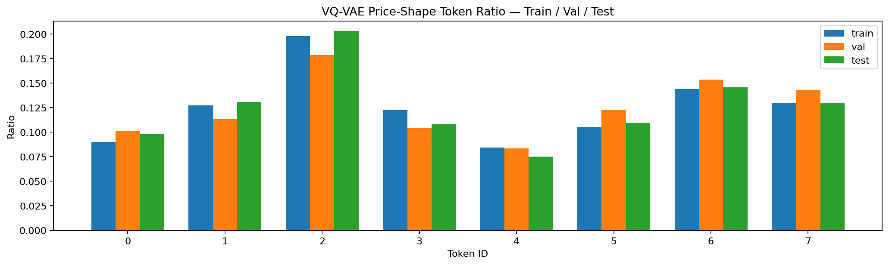

#### K=12

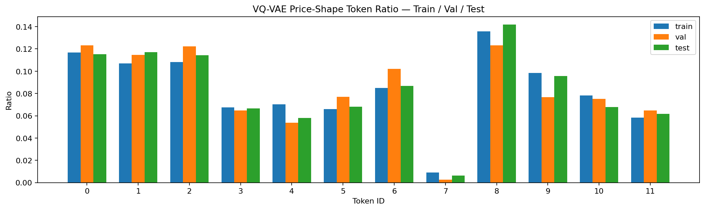

#### K=16

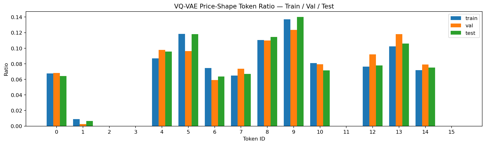

해석:

- K=8은 모든 token이 안정적으로 사용되지만 token 하나가 담당하는 영역이 넓습니다.
- K=12는 모든 token을 사용하면서도 K=8보다 더 세밀한 분포를 보입니다.
- K=16은 4개 token이 완전히 죽어 있어 실제로는 K=12 수준의 vocabulary처럼 동작합니다.

### 3.2 Per-symbol Token Distribution

종목별 token distribution이 특정 symbol에 과도하게 의존하는지 확인합니다.

#### K=8

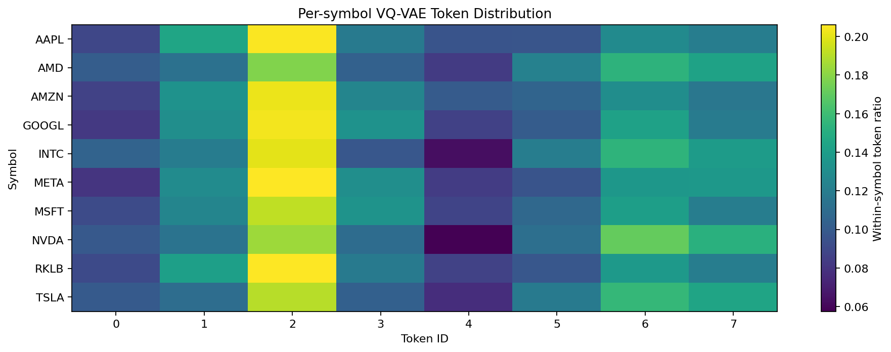

#### K=12

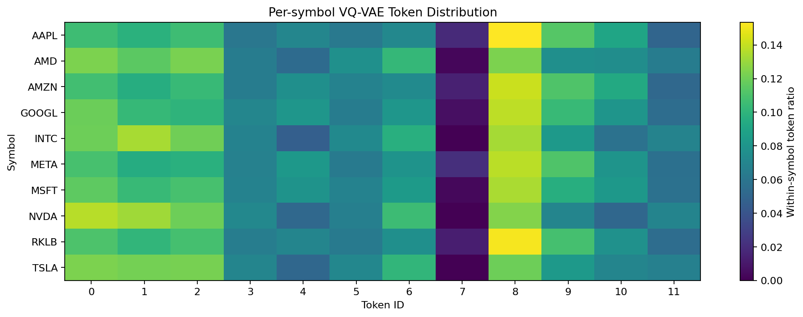

#### K=16

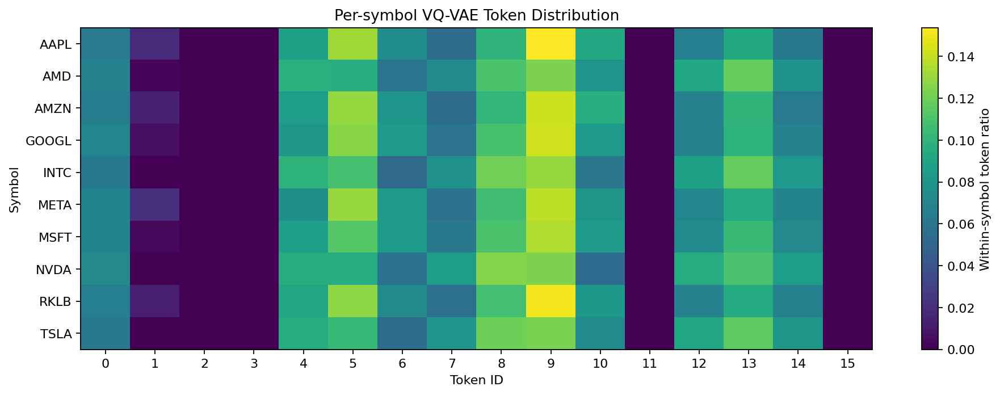

해석:

- 세 K 모두 특정 종목 하나에만 붙는 token보다는 여러 종목에서 반복되는 token이 많습니다.
- multi-symbol dataset이 단일 종목 실험보다 공통 price-shape vocabulary 학습에 더 적합하다는 신호입니다.
- K=12는 dead token 없이 per-symbol distribution이 비교적 안정적입니다.

### 3.3 Mean Feature Heatmap

각 token이 어떤 평균 price-shape feature를 대표하는지 확인합니다.

#### K=8

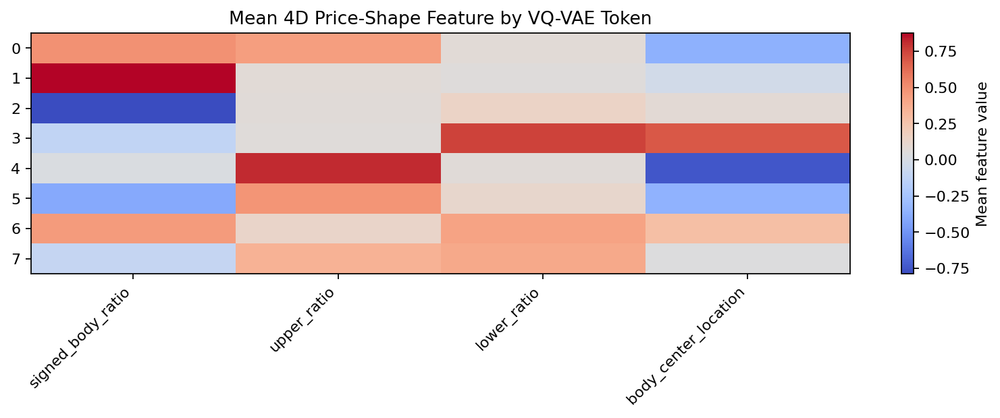

#### K=12

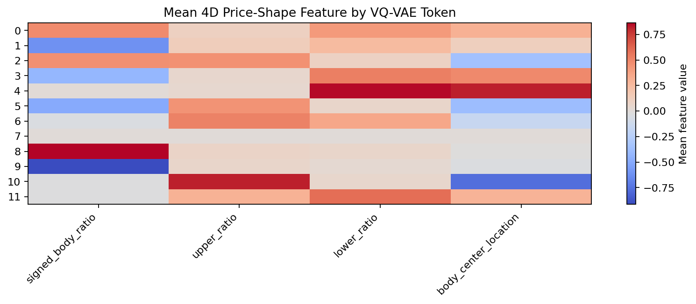

#### K=16

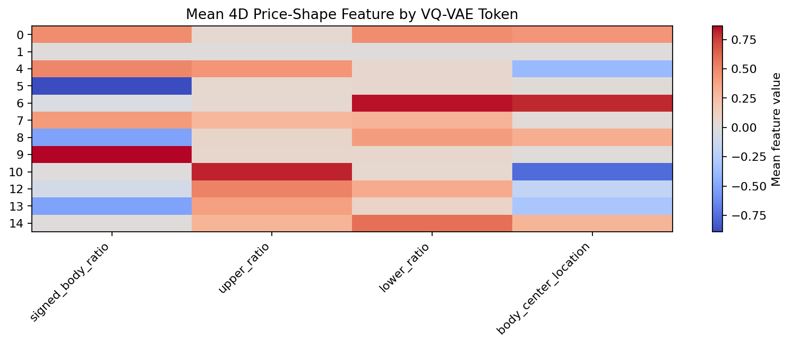

해석:

- K=8은 큰 범주의 bullish / bearish / wick pattern을 잘 나누지만 coarse합니다.
- K=12는 body 방향, upper wick, lower wick, body 위치가 더 세밀하게 분리됩니다.
- K=16은 K=12와 유사한 수준의 feature pattern을 보이지만 dead token이 있어 효율이 떨어집니다.

### 3.4 Prototype Candles

평균 feature를 candle glyph로 변환해 token별 prototype이 사람이 보기에도 구분되는지 확인합니다.

#### K=8

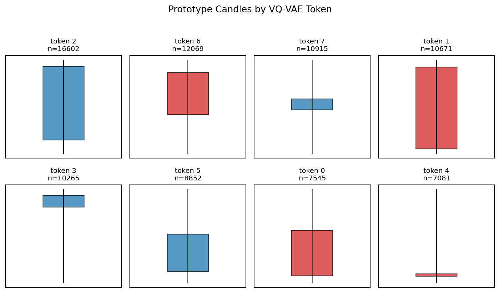

#### K=12

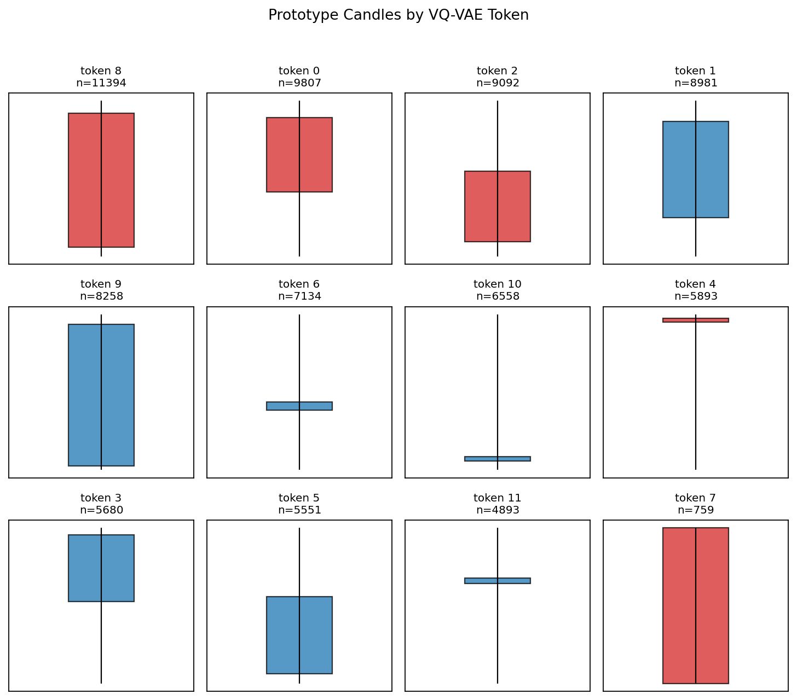

#### K=16

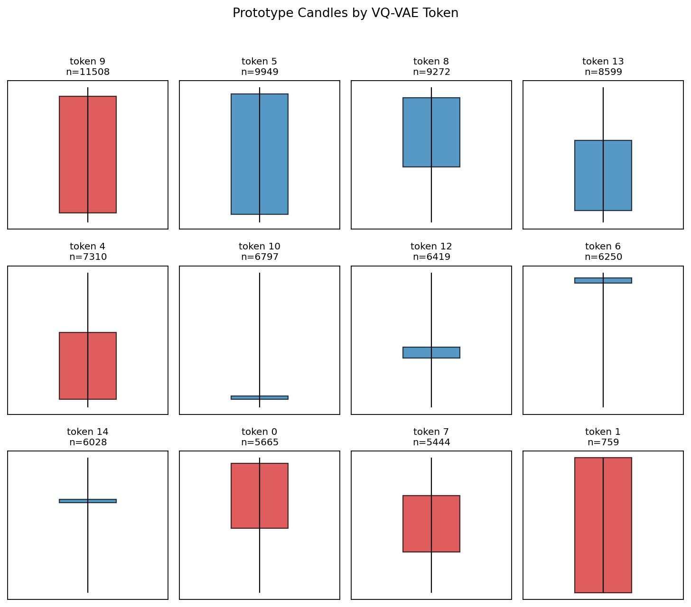

해석:

- 세 K 모두 price-shape token이 무작위 label은 아니며, 직관적인 candle morphology를 어느 정도 대표합니다.
- K=12는 K=8보다 prototype이 더 다양하면서도 K=16처럼 codebook을 낭비하지 않습니다.

### 3.5 VQ-VAE vs KMeans

VQ-VAE token distribution과 KMeans cluster distribution을 비교합니다.

#### K=8

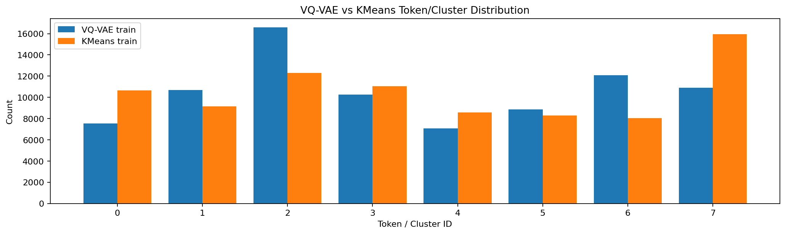

#### K=12

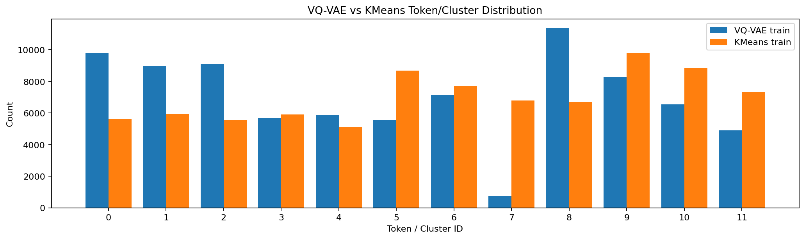

#### K=16

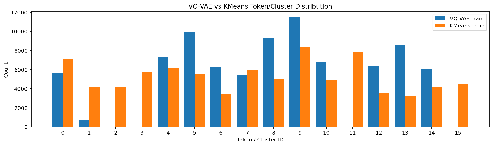

해석:

- KMeans는 모든 K에서 cluster를 더 균등하게 사용합니다.
- 특히 K=16에서 KMeans는 16개 cluster를 모두 쓰지만, VQ-VAE는 12개 token만 사용합니다.
- 따라서 현재 4D handcrafted feature 설정에서는 KMeans가 매우 강한 baseline입니다.

### 3.6 Figure Index

전체 figure 목록은 다음과 같습니다.

| K | Figure | Path |
|---|--------|------|
| 8 | Global token ratio | `runs/phase_1a_price_shape_NASDAQ_1m_k8/figures/01_global_token_ratio_histogram.png` |
| 8 | Per-symbol heatmap | `runs/phase_1a_price_shape_NASDAQ_1m_k8/figures/02_per_symbol_token_heatmap.png` |
| 8 | Per-symbol ratio chart | `runs/phase_1a_price_shape_NASDAQ_1m_k8/figures/03_per_symbol_token_ratio_chart.png` |
| 8 | Split ratio difference | `runs/phase_1a_price_shape_NASDAQ_1m_k8/figures/04_split_token_ratio_difference.png` |
| 8 | Mean feature heatmap | `runs/phase_1a_price_shape_NASDAQ_1m_k8/figures/05_mean_feature_heatmap.png` |
| 8 | Prototype candles | `runs/phase_1a_price_shape_NASDAQ_1m_k8/figures/06_prototype_candles.png` |
| 8 | Feature scatter | `runs/phase_1a_price_shape_NASDAQ_1m_k8/figures/07_feature_scatter.png` |
| 8 | VQ-VAE vs KMeans | `runs/phase_1a_price_shape_NASDAQ_1m_k8/figures/08_vqvae_vs_kmeans_histogram.png` |
| 12 | Global token ratio | `runs/phase_1a_price_shape_NASDAQ_1m_k12/figures/01_global_token_ratio_histogram.png` |
| 12 | Per-symbol heatmap | `runs/phase_1a_price_shape_NASDAQ_1m_k12/figures/02_per_symbol_token_heatmap.png` |
| 12 | Per-symbol ratio chart | `runs/phase_1a_price_shape_NASDAQ_1m_k12/figures/03_per_symbol_token_ratio_chart.png` |
| 12 | Split ratio difference | `runs/phase_1a_price_shape_NASDAQ_1m_k12/figures/04_split_token_ratio_difference.png` |
| 12 | Mean feature heatmap | `runs/phase_1a_price_shape_NASDAQ_1m_k12/figures/05_mean_feature_heatmap.png` |
| 12 | Prototype candles | `runs/phase_1a_price_shape_NASDAQ_1m_k12/figures/06_prototype_candles.png` |
| 12 | Feature scatter | `runs/phase_1a_price_shape_NASDAQ_1m_k12/figures/07_feature_scatter.png` |
| 12 | VQ-VAE vs KMeans | `runs/phase_1a_price_shape_NASDAQ_1m_k12/figures/08_vqvae_vs_kmeans_histogram.png` |
| 16 | Global token ratio | `runs/phase_1a_price_shape_NASDAQ_1m_k16/figures/01_global_token_ratio_histogram.png` |
| 16 | Per-symbol heatmap | `runs/phase_1a_price_shape_NASDAQ_1m_k16/figures/02_per_symbol_token_heatmap.png` |
| 16 | Per-symbol ratio chart | `runs/phase_1a_price_shape_NASDAQ_1m_k16/figures/03_per_symbol_token_ratio_chart.png` |
| 16 | Split ratio difference | `runs/phase_1a_price_shape_NASDAQ_1m_k16/figures/04_split_token_ratio_difference.png` |
| 16 | Mean feature heatmap | `runs/phase_1a_price_shape_NASDAQ_1m_k16/figures/05_mean_feature_heatmap.png` |
| 16 | Prototype candles | `runs/phase_1a_price_shape_NASDAQ_1m_k16/figures/06_prototype_candles.png` |
| 16 | Feature scatter | `runs/phase_1a_price_shape_NASDAQ_1m_k16/figures/07_feature_scatter.png` |
| 16 | VQ-VAE vs KMeans | `runs/phase_1a_price_shape_NASDAQ_1m_k16/figures/08_vqvae_vs_kmeans_histogram.png` |

---

## 4. K=8 Interpretation

K=8은 모든 token을 사용했습니다.

```text
train used: 8 / 8
val used:   8 / 8
test used:  8 / 8
dead ratio: 0.0
```

장점:

- dead token이 없습니다.
- train / val / test 모두에서 token distribution이 안정적입니다.
- per-symbol entropy range가 좁아 여러 종목에서 token이 비교적 고르게 쓰입니다.

단점:

- vocabulary가 너무 거칩니다.
- 평균 semantic consistency가 가장 나쁩니다.

```text
K=8 mean semantic consistency: 0.260
K=12 mean semantic consistency: 0.194
K=16 mean semantic consistency: 0.196
```

해석:

> K=8은 안정적이지만 서로 다른 price-shape를 하나의 token 안에 많이 섞는 coarse vocabulary입니다.

---

## 5. K=12 Interpretation

K=12는 현재 가장 균형이 좋습니다.

```text
train used: 12 / 12
val used:   12 / 12
test used:  12 / 12
dead ratio: 0.0
```

장점:

- 모든 token을 사용합니다.
- dead token이 없습니다.
- K=8보다 semantic consistency가 크게 좋아졌습니다.
- K=16과 거의 같은 consistency를 보이면서도 codebook 낭비가 없습니다.
- held-out symbol에서도 token distribution이 크게 무너지지 않습니다.

주의점:

- token 7은 매우 적게 사용됩니다.

```text
token 7 train count: 759 / 84,000
```

이는 rare shape token 또는 거의 죽어가는 token일 수 있습니다. 다만 val/test에서도 완전히 사라지지는 않으므로 현재 단계에서는 허용 가능합니다.

해석:

> K=12는 dead token 없이 적절한 세분화를 제공하는 현재 최선의 기본 후보입니다.

---

## 6. K=16 Interpretation

K=16은 추가 capacity를 충분히 활용하지 못했습니다.

```text
train used: 12 / 16
val used:   12 / 16
test used:  12 / 16
dead tokens: 4
dead ratio: 0.25
```

죽은 token:

```text
2, 3, 11, 15
```

K=16은 entropy와 semantic consistency가 K=12와 거의 같습니다.

```text
K=12 train entropy: 3.454
K=16 train entropy: 3.460

K=12 mean semantic consistency: 0.194
K=16 mean semantic consistency: 0.196
```

해석:

> K=16은 실제로는 K=12 tokenizer처럼 동작하고 있으며, 나머지 4개 codebook entry는 낭비되고 있습니다.

---

## 7. Held-out Symbol Generalization

이번 실험은 train에 없는 symbol에서 token distribution이 유지되는지 확인했습니다.

```text
val:  AMD
test: INTC, RKLB
```

세 K 모두 val/test에서 token distribution이 크게 무너지지 않았습니다.

특히 train-test ratio difference는 모두 작았습니다.

```text
K=8:  0.046
K=12: 0.060
K=16: 0.053
```

해석:

> 학습에 사용하지 않은 종목에서도 price-shape token vocabulary가 어느 정도 유지됩니다.

이는 multi-symbol dataset을 사용하는 방향이 단일 종목 실험보다 훨씬 타당하다는 신호입니다.

---

## 8. KMeans Baseline Comparison

KMeans baseline은 모든 K에서 dead token 없이 모든 cluster를 사용했습니다.

| KMeans Metric | K=8 | K=12 | K=16 |
|---|---:|---:|---:|
| Train used clusters | 8 / 8 | 12 / 12 | 16 / 16 |
| Dead ratio | 0.000 | 0.000 | 0.000 |
| Train entropy | 2.962 | 3.556 | 3.944 |

KMeans는 codebook utilization과 entropy 측면에서 VQ-VAE보다 안정적입니다.

다만 entropy가 높다는 것이 곧 더 의미 있는 tokenization을 뜻하지는 않습니다. 그러나 현재 4D handcrafted feature 설정에서는 KMeans가 매우 강한 baseline입니다.

해석:

> 현재 결과만으로는 VQ-VAE가 KMeans보다 우월하다고 주장할 수 없습니다.

향후 Phase 1A에서는 VQ-VAE와 KMeans를 동일한 기준으로 계속 비교해야 합니다.

---

## 9. Overall Ranking

현재 결과 기준 순위는 다음과 같습니다.

```text
1. K=12
2. K=8
3. K=16
```

### Why K=12?

```text
- dead token 없음
- K=8보다 semantic consistency가 좋음
- K=16과 거의 같은 consistency
- K=16보다 codebook 낭비가 없음
- held-out symbol에서도 distribution 유지
```

### Why not K=8?

```text
- 안정적이지만 너무 coarse함
- token 내부 shape 분산이 큼
```

### Why not K=16?

```text
- 4개 dead token 발생
- 실제 사용 token 수가 K=12와 같음
- 추가 capacity의 이점이 없음
```

---

## 10. Conclusion

Phase 1A의 핵심 가설에 대해서는 긍정적인 신호가 있습니다.

```text
여러 NASDAQ 종목의 1분봉 price-shape를
공유 discrete token vocabulary로 묶을 수 있다.
```

하지만 현재 단계에서 가능한 주장은 여기까지입니다.

가능한 주장:

```text
- 여러 종목에서 공유되는 price-shape token 후보를 만들었다.
- K=12가 현재 가장 균형 잡힌 VQ-VAE codebook size로 보인다.
- held-out symbol에서도 token distribution이 크게 무너지지 않는다.
```

아직 하면 안 되는 주장:

```text
- market state를 발견했다.
- 미래 수익률을 예측한다.
- trading signal로 사용할 수 있다.
- VQ-VAE가 KMeans보다 우월하다.
```

최종 판단:

> **현재 Phase 1A VQ-VAE 기본값은 `CODEBOOK_SIZE = 12`가 가장 적절합니다.**

---

## 11. Recommended Next Steps

다음 작업은 아래 순서로 진행하는 것이 좋습니다.

1. `CODEBOOK_SIZE = 12`를 Phase 1A 기본값으로 설정
2. K=12 기준 VQ-VAE와 KMeans를 더 정밀 비교
   - token별 prototype 비교
   - per-symbol distribution 비교
   - semantic consistency 비교
3. rare token 분석
   - 특히 VQ-VAE K=12의 token 7
4. reconstruction loss와 semantic consistency를 함께 기록하는 result table 추가
5. Phase 1B로 넘어가기 전, KMeans tokenizer를 대안 후보로 유지

