# Phase 1B Result — Shape + Range Scale as Encoder Input

이 문서는 다음 실행 결과를 해석합니다.

```text
runs/phase_1b_shape_range_NASDAQ_1m_k12
```

Phase 1B의 원래 실험은 Phase 1A의 4D price-shape feature에 `range_scale_z`를 직접 추가해 5D feature를 VQ-VAE와 KMeans에 입력하는 방식이었습니다.

```text
signed_body_ratio
upper_ratio
lower_ratio
body_center_location
range_scale_z
```

핵심 결론은 다음과 같습니다.

> **range scale 정보를 token에 반영하는 데는 성공했지만, held-out symbol 일반화는 Phase 1A보다 크게 나빠졌습니다.**
>
> 따라서 range scale은 encoder 입력 feature로 직접 섞기보다, shape token과 별도의 range bucket으로 분리하는 방향이 더 적절합니다.

---

## 1. Experiment Setup

| Item | Value |
|------|-------|
| Market | `NASDAQ` |
| Interval | `1m` |
| Codebook size | `K = 12` |
| Train symbols | `AAPL`, `MSFT`, `NVDA`, `TSLA`, `AMZN`, `META`, `GOOGL` |
| Val symbols | `AMD` |
| Test symbols | `INTC`, `RKLB` |
| Train candles | `84,000` |
| Val candles | `12,000` |
| Test candles | `24,000` |

Range scale normalization은 train split 기준으로 계산되었습니다.

```text
range_pct = (high - low) / reference_price
log_range_pct = log1p(range_pct)
range_scale_z = train log_range_pct 기준 z-score
```

Train range scale stats:

```text
mean = 0.0008782068
std  = 0.0008006769
```

---

## 2. VQ-VAE Summary

| Split | Used Tokens | Dead Tokens | Entropy | Mean Semantic Consistency | Reconstruction MSE |
|-------|-------------|-------------|---------|----------------------------|--------------------|
| train | 12 / 12 | 0 | 3.2015 | 0.5599 | 0.0569 |
| val | 12 / 12 | 0 | 3.4190 | 0.5684 | 0.0876 |
| test | 12 / 12 | 0 | 3.3697 | 0.5757 | 0.1017 |

좋은 점은 명확합니다.

```text
codebook collapse는 발생하지 않았습니다.
모든 split에서 12개 token이 모두 사용되었습니다.
```

하지만 split 간 token 분포 차이는 큽니다.

| Metric | Phase 1A VQ-VAE | Phase 1B VQ-VAE |
|--------|-----------------|-----------------|
| val-train L1 diff | 0.1260 | 0.8648 |
| test-train L1 diff | 0.0598 | 1.0114 |

Phase 1A보다 held-out symbol distribution이 크게 흔들렸습니다.

---

## 3. Visual Evidence

### 3.1 Global Token Ratio

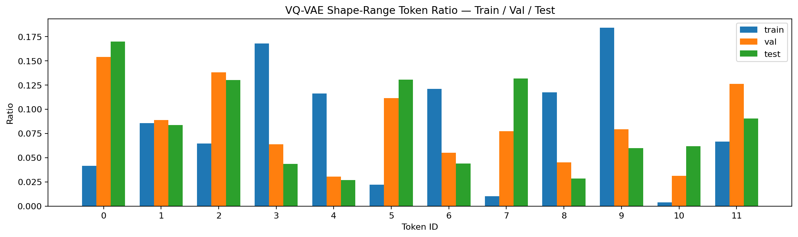

Train에서는 token `9`, `3`, `6`, `8`, `4`가 많이 사용되었습니다. 반면 val/test에서는 token `0`, `2`, `5`, `7`, `11`의 비중이 크게 증가했습니다.

이는 held-out symbol인 `AMD`, `INTC`, `RKLB`의 range distribution이 train symbols와 다르게 token assignment에 반영되었음을 보여줍니다.

### 3.2 Per-symbol Token Heatmap

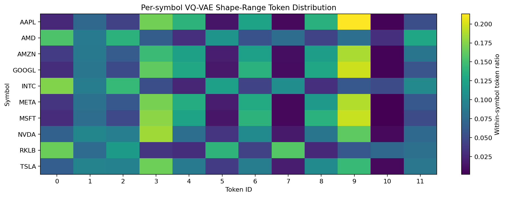

Train symbols인 `AAPL`, `AMZN`, `GOOGL`, `META`, `MSFT`는 서로 비슷한 token pattern을 보입니다. 하지만 held-out symbols인 `AMD`, `INTC`, `RKLB`는 token `0`, `2`, `5`, `7`, `10` 쪽 비중이 커집니다.

이 결과는 Phase 1B token이 common shape vocabulary라기보다 symbol별 volatility / range profile에 민감해졌다는 신호입니다.

### 3.3 Mean Feature Heatmap

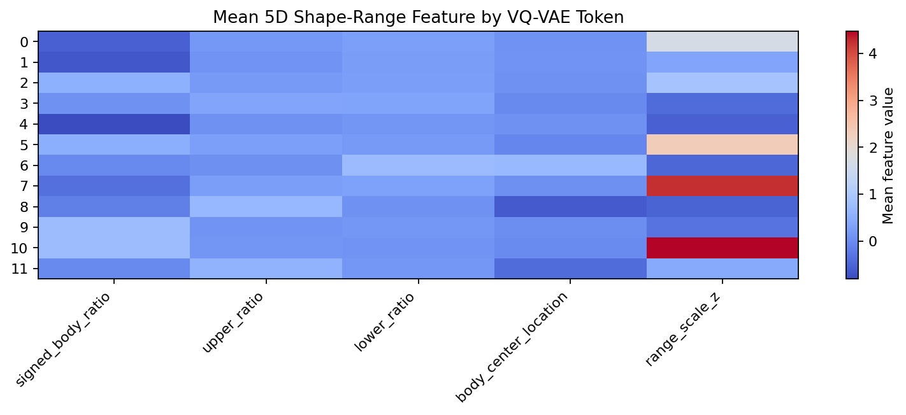

`range_scale_z` 열이 token을 강하게 분리합니다.

대표적으로:

| Token | Count | Mean `range_scale_z` | Interpretation |
|-------|-------|----------------------|----------------|
| 3 | 14,076 | -0.43 | low-range doji / wick 계열 |
| 4 | 9,753 | -0.54 | low-range bearish body |
| 6 | 10,169 | -0.47 | low-range lower-wick 계열 |
| 8 | 9,848 | -0.50 | low-range upper-wick 계열 |
| 9 | 15,469 | -0.32 | low-range bullish body |
| 0 | 3,473 | 1.69 | high-range bearish 계열 |
| 5 | 1,839 | 2.32 | high-range bullish 계열 |
| 7 | 860 | 4.24 | extreme high-range 계열 |
| 10 | 330 | 4.48 | extreme high-range bullish 계열 |

즉, range scale 정보는 확실히 token에 들어갔습니다. 문제는 그 영향이 너무 강하다는 점입니다.

### 3.4 Prototype Candles

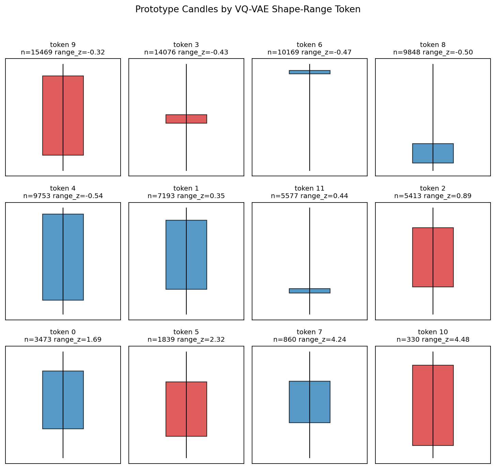

Prototype candle을 보면 비슷한 price-shape라도 `range_z` 값에 따라 다른 token으로 분리됩니다.

이 자체는 Phase 1B의 의도와 맞습니다. 하지만 결과적으로 shape token vocabulary가 range regime에 의해 크게 쪼개졌습니다.

### 3.5 Feature Scatter

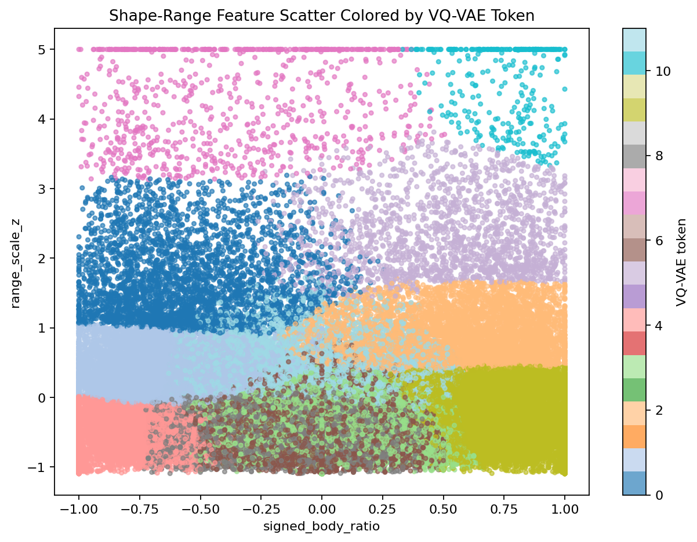

`range_scale_z` 축으로 token이 층처럼 나뉩니다. 특히 `range_scale_z = 5` 근처에 clipping된 high-range tail이 존재합니다.

이는 `range_scale_z`가 token assignment를 지배하고 있음을 시각적으로 보여줍니다.

### 3.6 VQ-VAE vs KMeans

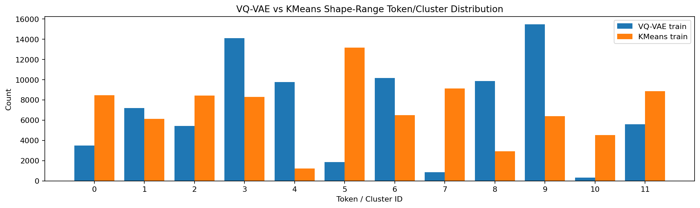

KMeans도 모든 cluster를 사용했고, VQ-VAE보다 더 균등한 cluster 분포를 보였습니다.

---

## 4. VQ-VAE vs KMeans

| Model | Split | Entropy | Mean Semantic Consistency | Notes |
|-------|-------|---------|----------------------------|-------|
| VQ-VAE | train | 3.2015 | 0.5599 | token 사용은 충분하지만 분포가 불균등함 |
| KMeans | train | 3.4330 | 0.5260 | 더 균등하고 내부 응집도도 좋음 |
| VQ-VAE | val | 3.4190 | 0.5684 | held-out AMD에서 분포 변화 큼 |
| KMeans | val | 3.3280 | 0.5329 | KMeans도 held-out 차이를 피하지 못함 |
| VQ-VAE | test | 3.3697 | 0.5757 | INTC/RKLB에서 high-range token 증가 |
| KMeans | test | 3.1573 | 0.5439 | KMeans도 range profile 차이에 민감함 |

KMeans 역시 held-out split 안정성이 좋지는 않았습니다.

```text
KMeans val-train L1  = 0.8620
KMeans test-train L1 = 0.9792
```

따라서 문제는 VQ-VAE만의 문제가 아니라, **range scale을 encoder 입력 feature로 직접 섞은 설계 자체의 문제**로 보는 것이 타당합니다.

---

## 5. Interpretation

Phase 1B as-input 방식은 다음에는 성공했습니다.

```text
shape + range scale을 반영한 token 분화
low-range / high-range candle 구분
extreme range candle token 분리
codebook collapse 방지
```

하지만 다음 문제가 더 큽니다.

```text
Phase 1A보다 held-out symbol token distribution이 크게 불안정
range_scale_z가 token assignment를 강하게 지배
high-range tail과 clipping 영향이 큼
KMeans baseline 대비 VQ-VAE 우위가 없음
```

따라서 이 결과는 Phase 1B의 최종 채택 결과라기보다 다음 결론을 주는 ablation으로 보는 것이 맞습니다.

> **range scale은 유용한 context지만, price-shape encoder feature에 직접 섞으면 common shape vocabulary를 불안정하게 만들 수 있습니다.**

---

## 6. Design Decision

다음 실험에서는 range scale을 encoder 입력으로 섞지 않습니다.

대신 representation을 분리합니다.

```text
shape_token  = VQ-VAE 또는 KMeans가 4D price-shape only feature에서 학습
range_bucket = train distribution 기준 range bucketizer가 별도 계산

final representation = (shape_token, range_bucket)
```

이 설계의 장점은 다음과 같습니다.

- shape vocabulary의 안정성을 Phase 1A처럼 유지할 수 있습니다.
- range / volatility context를 잃지 않습니다.
- token이 shape와 range 중 무엇을 의미하는지 해석하기 쉬워집니다.
- Phase 2 Sequential Dynamics에서 transition을 다음 두 수준으로 나눠 볼 수 있습니다.

```text
shape_token sequence
(shape_token, range_bucket) sequence
```

---

## 7. Next Notebook

다음 notebook은 range를 별도 bucket으로 분리합니다.

```text
02_phase_1b_shape_token_plus_range_bucket.ipynb
```

핵심 질문은 다음과 같습니다.

> **price-shape token vocabulary는 유지하면서 range context를 별도 bucket으로 붙이면 Phase 1A의 안정성과 Phase 1B의 정보량을 동시에 얻을 수 있는가?**

---

# Phase 1B Revised Result — Shape Token + Separate Range Bucket

이 섹션은 다음 실행 결과를 해석합니다.

```text
runs/phase_1b_shape_token_range_bucket_NASDAQ_1m_k12
```

이 revised experiment는 앞선 `range_scale_z as encoder input` 방식의 문제를 해결하기 위해 representation을 분리했습니다.

```text
shape_token  = 4D price-shape only feature에서 VQ-VAE가 학습
range_bucket = train range distribution 기준 별도 bucketizer가 계산

final representation = (shape_token, range_bucket)
```

핵심 결론은 다음과 같습니다.

> **shape token의 안정성은 Phase 1A 수준으로 회복되었고, range / volatility 차이는 별도 bucket에서 명확히 드러났습니다.**
>
> 따라서 Phase 1B의 기본 설계는 `range_scale_z` encoder input 방식이 아니라 `shape_token + range_bucket` 방식이 더 적절합니다.

---

## 8. Revised Experiment Setup

| Item | Value |
|------|-------|
| Market | `NASDAQ` |
| Interval | `1m` |
| Codebook size | `K = 12` |
| Range buckets | `6` |
| Train symbols | `AAPL`, `MSFT`, `NVDA`, `TSLA`, `AMZN`, `META`, `GOOGL` |
| Val symbols | `AMD` |
| Test symbols | `INTC`, `RKLB` |
| Train candles | `84,000` |
| Val candles | `12,000` |
| Test candles | `24,000` |

Range bucket은 train split의 `log_range_pct` quantile 기준으로 fit했습니다.

```text
range_pct = (high - low) / reference_price
log_range_pct = log1p(range_pct)
```

Bucket edges:

| Bucket | Label | Train 기준 의미 |
|--------|-------|----------------|
| 0 | `very_low` | 하위 20% |
| 1 | `low` | 20% ~ 40% |
| 2 | `normal` | 40% ~ 60% |
| 3 | `high` | 60% ~ 80% |
| 4 | `very_high` | 80% ~ 95% |
| 5 | `extreme` | 상위 5% |

Actual edges:

```text
0.0003542958
0.0005636291
0.0008127312
0.0012313341
0.0022654454
```

---

## 9. Shape Token Stability

Shape token은 Phase 1A와 같은 4D price-shape feature만 사용합니다.

| Split | Used Tokens | Dead Tokens | Entropy | Mean Semantic Consistency | Reconstruction MSE |
|-------|-------------|-------------|---------|----------------------------|--------------------|
| train | 12 / 12 | 0 | 3.4541 | 0.1940 | 0.0132 |
| val | 12 / 12 | 0 | 3.4183 | 0.1951 | 0.0137 |
| test | 12 / 12 | 0 | 3.4300 | 0.1945 | 0.0132 |

Split 간 shape token distribution 차이는 다음과 같습니다.

| Representation | val-train L1 | test-train L1 |
|----------------|--------------|---------------|
| Phase 1A shape only | 0.1260 | 0.0598 |
| Phase 1B range as encoder input | 0.8648 | 1.0114 |
| Phase 1B separate range bucket — shape only view | 0.1260 | 0.0598 |

이 결과가 가장 중요합니다.

```text
range를 encoder input에 직접 넣으면 shape token 분포가 무너졌습니다.
range를 별도 bucket으로 빼면 shape token 분포는 Phase 1A 수준으로 회복됩니다.
```

### 9.1 Shape Token Ratio

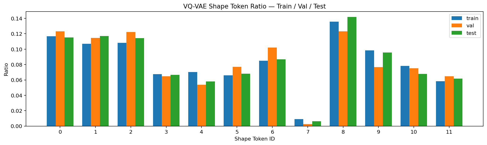

Train / val / test의 shape token ratio가 비교적 안정적으로 유지됩니다. 이것은 revised design이 common price-shape vocabulary를 보존한다는 증거입니다.

---

## 10. Range Bucket Result

Train은 quantile bucketizer를 fit한 split이므로 의도적으로 다음 비율을 가집니다.

```text
very_low   20%
low        20%
normal     20%
high       20%
very_high  15%
extreme     5%
```

하지만 held-out symbols에서는 분포가 크게 바뀝니다.

| Split | very_low | low | normal | high | very_high | extreme |
|-------|----------|-----|--------|------|-----------|---------|
| train | 20.0% | 20.0% | 20.0% | 20.0% | 15.0% | 5.0% |
| val | 3.7% | 5.4% | 8.8% | 19.5% | 34.5% | 28.2% |
| test | 2.9% | 3.8% | 6.3% | 14.2% | 32.3% | 40.5% |

Split 차이:

```text
range val-train L1  = 0.8533
range test-train L1 = 1.0570
```

이 차이는 나쁜 결과라기보다, held-out symbols의 volatility profile이 train symbols와 다르다는 정보를 분리해서 보여주는 결과입니다.

### 10.1 Range Bucket Ratio

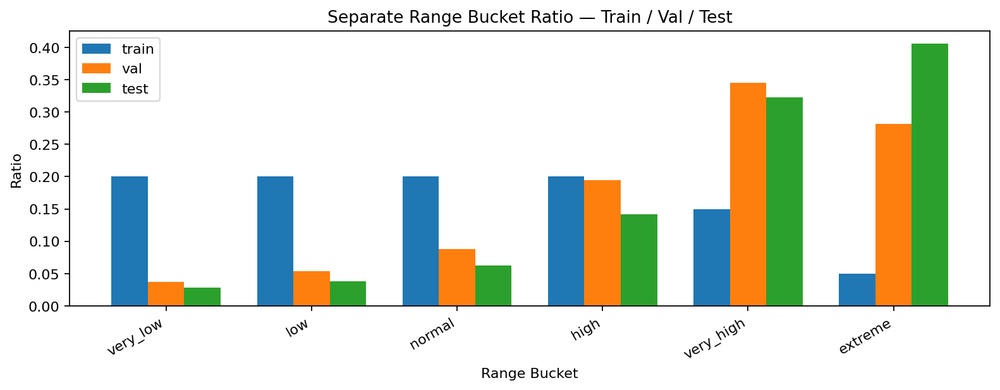

`AMD`, `INTC`, `RKLB`가 포함된 val/test는 `very_high`, `extreme` bucket 비중이 매우 큽니다.

---

## 11. Per-symbol Range Interpretation

### 11.1 Per-symbol Range Bucket Heatmap

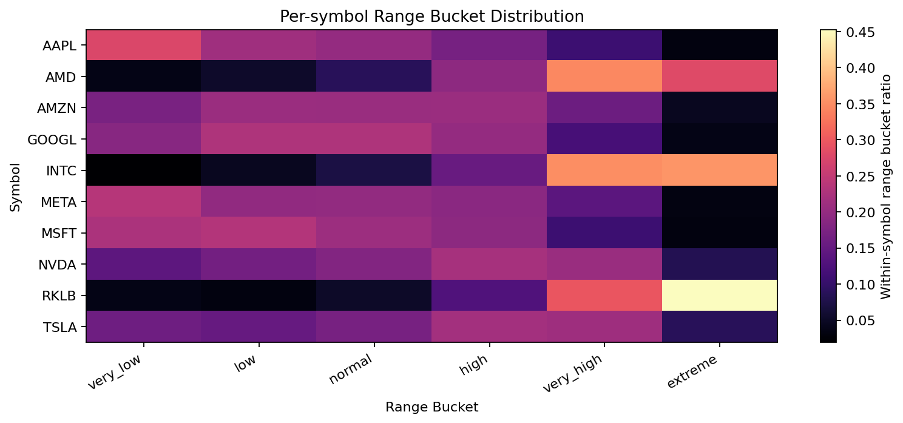

Per-symbol range bucket 분포는 다음처럼 해석할 수 있습니다.

| Symbol group | Interpretation |
|--------------|----------------|
| `AAPL`, `MSFT`, `META`, `GOOGL` | low / normal range 비중이 큼 |
| `NVDA`, `TSLA` | high / very_high 쪽으로 이동 |
| `AMD`, `INTC`, `RKLB` | very_high / extreme 비중이 큼 |

특히 `RKLB`는 extreme bucket 비중이 매우 큽니다.

```text
RKLB range bucket counts:
very_low   455
low        382
normal     639
high       1,544
very_high  3,546
extreme    5,434
```

즉, 이번 dataset에서 `RKLB`는 명확히 high-volatility symbol로 관측됩니다.

---

## 12. Shape × Range Pair Result

가능한 pair 수는 다음과 같습니다.

```text
12 shape tokens × 6 range buckets = 72 pairs
```

실제 사용된 pair 수:

| Split | Used Pairs | Dead Pairs | Pair Entropy |
|-------|------------|------------|--------------|
| train | 67 / 72 | 5 | 5.8853 |
| val | 67 / 72 | 5 | 5.5842 |
| test | 67 / 72 | 5 | 5.4046 |

거의 모든 shape-range 조합이 관측되었습니다. 즉, `(shape_token, range_bucket)` representation은 충분한 coverage를 가집니다.

다만 pair distribution의 split 차이는 큽니다.

```text
pair val-train L1  = 0.8930
pair test-train L1 = 1.0636
```

이것은 range bucket 분포 차이가 pair에 반영되기 때문입니다. 중요한 점은 이제 이 차이를 다음처럼 분해해서 볼 수 있다는 것입니다.

```text
shape token distribution은 안정적입니다.
range bucket distribution은 held-out symbol에서 다릅니다.
pair distribution은 range 차이 때문에 다릅니다.
```

### 12.1 Shape × Range Pair Heatmap

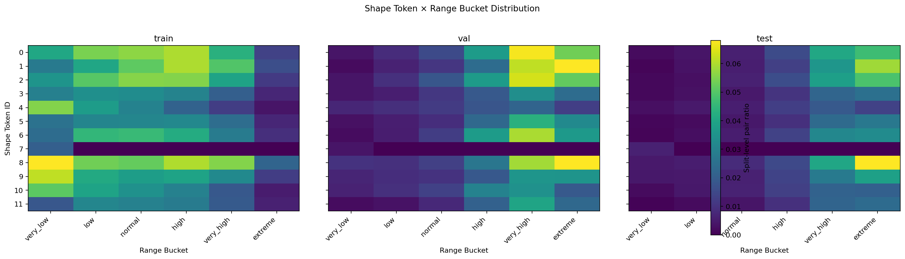

Train에서는 range bucket이 고르게 분포하지만, val/test에서는 `very_high`, `extreme` 쪽으로 pair density가 이동합니다. 하지만 shape token 축 자체가 무너지는 것은 아닙니다.

---

## 13. KMeans Baseline

KMeans도 4D price-shape feature만 사용했습니다.

| Model | shape val-train L1 | shape test-train L1 | pair val-train L1 | pair test-train L1 |
|-------|--------------------|---------------------|-------------------|--------------------|
| VQ-VAE | 0.1260 | 0.0598 | 0.8930 | 1.0636 |
| KMeans | 0.1098 | 0.0567 | 0.8921 | 1.0644 |

KMeans는 shape token distribution 기준으로 VQ-VAE보다 약간 더 안정적입니다.

따라서 기존 결론은 유지됩니다.

> **4D handcrafted price-shape feature에서는 KMeans가 강한 baseline입니다. VQ-VAE를 계속 사용할 이유는 추가 검증이 필요합니다.**

하지만 이번 revised Phase 1B의 핵심은 VQ-VAE 우위가 아니라, representation을 분리했을 때 원인 해석이 가능해진다는 점입니다.

---

## 14. Revised Interpretation

이번 revised experiment는 설계상 성공으로 볼 수 있습니다.

성공한 점:

```text
shape token 안정성 유지
range / volatility context 별도 보존
held-out symbol의 volatility 차이 명확히 확인
shape-range pair coverage 충분함
range가 shape vocabulary를 오염시키지 않음
```

주의할 점:

```text
pair distribution은 range 차이 때문에 split 간 차이가 큼
KMeans baseline은 여전히 강함
range bucket threshold는 train symbols에 의존함
RKLB 같은 high-volatility symbol은 extreme bucket에 과도하게 몰림
```

최종적으로 Phase 1B의 기본 표현은 다음 방식이 적절합니다.

```text
shape_token = Phase 1A 방식
range_bucket = 별도 train-quantile bucket
representation = (shape_token, range_bucket)
```

---

## 15. Updated Design Decision

Phase 1B에서 채택할 설계는 다음입니다.

```text
Do not:
  [price-shape features + range_scale_z] → encoder → token

Do:
  price-shape features → encoder / clustering → shape_token
  range scale → separate bucketizer → range_bucket
  final representation = (shape_token, range_bucket)
```

이제 Phase 1B의 연구 질문은 다음처럼 정리합니다.

> **shape vocabulary를 유지하면서 range context를 별도 bucket으로 붙일 수 있는가?**

이번 실행 결과의 답은 다음입니다.

> **가능합니다. shape token 안정성은 Phase 1A 수준으로 유지되었고, range bucket은 held-out symbol의 volatility 차이를 명확히 분리해 보여주었습니다.**

---

# Phase 1B Revised Result A — Alternative Held-out Symbols

이 섹션은 다음 실행 결과를 추가로 기록합니다.

```text
runs/phase_1b_shape_token_range_bucket_NASDAQ_1m_k12_a
```

이 run은 revised Phase 1B의 동일한 설계를 사용하되, held-out symbols를 교체한 결과입니다.

기존 revised run:

```text
val:  AMD
test: INTC, RKLB
```

이번 `k12_a` run:

```text
val:  AVGO
test: NFLX, PLTR
```

Train symbols는 동일합니다.

```text
AAPL, MSFT, NVDA, TSLA, AMZN, META, GOOGL
```

---

## 16. Alternative Split Setup

| Item | Value |
|------|-------|
| Market | `NASDAQ` |
| Interval | `1m` |
| Codebook size | `K = 12` |
| Range buckets | `6` |
| Train symbols | `AAPL`, `MSFT`, `NVDA`, `TSLA`, `AMZN`, `META`, `GOOGL` |
| Val symbols | `AVGO` |
| Test symbols | `NFLX`, `PLTR` |
| Train candles | `84,000` |
| Val candles | `12,000` |
| Test candles | `24,000` |

---

## 17. Shape Token Stability — Alternative Split

| Split | Used Tokens | Dead Tokens | Entropy | Mean Semantic Consistency | Reconstruction MSE |
|-------|-------------|-------------|---------|----------------------------|--------------------|
| train | 12 / 12 | 0 | 3.4541 | 0.1940 | 0.0132 |
| val | 12 / 12 | 0 | 3.4756 | 0.1913 | 0.0120 |
| test | 12 / 12 | 0 | 3.4994 | 0.1933 | 0.0128 |

Shape token split 차이:

| Run | val-train L1 | test-train L1 |
|-----|--------------|---------------|
| revised `k12` — AMD / INTC / RKLB | 0.1260 | 0.0598 |
| revised `k12_a` — AVGO / NFLX / PLTR | 0.2159 | 0.0976 |

`k12_a`에서는 `AVGO` validation split의 shape distribution 차이가 약간 커졌습니다. 하지만 `range_scale_z as encoder input` ablation의 차이보다는 훨씬 작습니다.

```text
range-as-input ablation:
val-train L1  = 0.8648
test-train L1 = 1.0114
```

따라서 shape token은 held-out symbol 조합이 바뀌어도 비교적 안정적이라고 볼 수 있습니다.

### 17.1 Shape Token Ratio

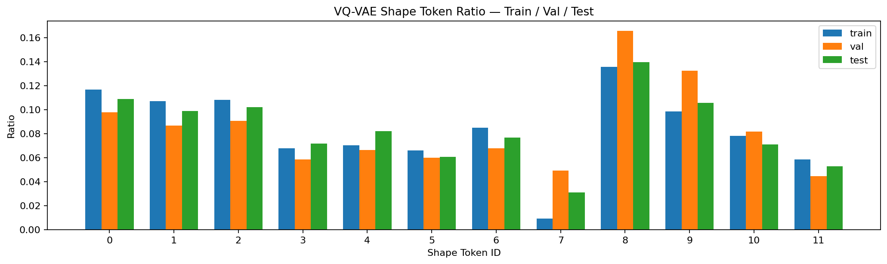

`AVGO`에서는 token `7`, `8`, `9` 비중이 train보다 다소 높습니다. 하지만 전체적으로 token collapse나 특정 token 독점은 관측되지 않습니다.

---

## 18. Range Bucket Result — Alternative Split

Range bucket split 차이는 이전 revised run보다 훨씬 작아졌습니다.

| Run | range val-train L1 | range test-train L1 |
|-----|--------------------|---------------------|
| revised `k12` — AMD / INTC / RKLB | 0.8533 | 1.0570 |
| revised `k12_a` — AVGO / NFLX / PLTR | 0.4122 | 0.2045 |

`k12_a`의 range distribution:

| Split | very_low | low | normal | high | very_high | extreme |
|-------|----------|-----|--------|------|-----------|---------|
| train | 20.0% | 20.0% | 20.0% | 20.0% | 15.0% | 5.0% |
| val `AVGO` | 14.1% | 9.9% | 15.4% | 23.3% | 25.5% | 11.8% |
| test `NFLX`, `PLTR` | 17.1% | 13.1% | 19.6% | 21.5% | 20.4% | 8.3% |

이전 `AMD / INTC / RKLB` 조합과 비교하면 `very_high`, `extreme` bucket 쏠림이 훨씬 약합니다.

### 18.1 Range Bucket Ratio

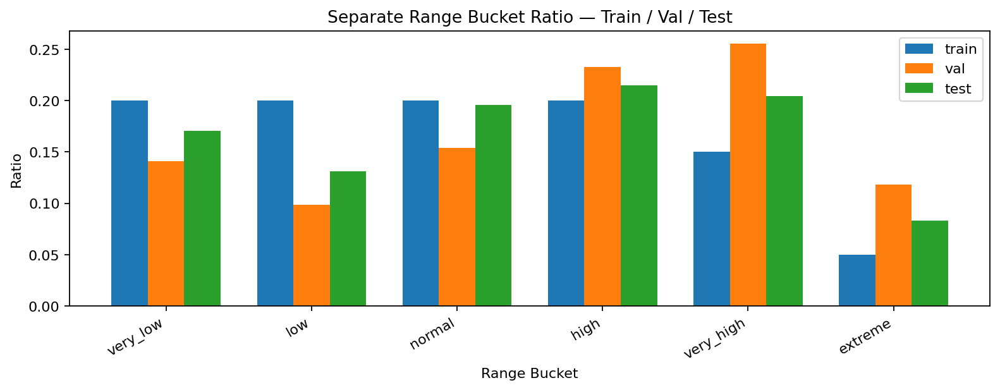

`AVGO`와 `PLTR`는 high / very_high 쪽으로 이동하지만, `RKLB`처럼 extreme bucket이 압도적으로 커지는 현상은 없습니다.

### 18.2 Per-symbol Range Bucket Heatmap

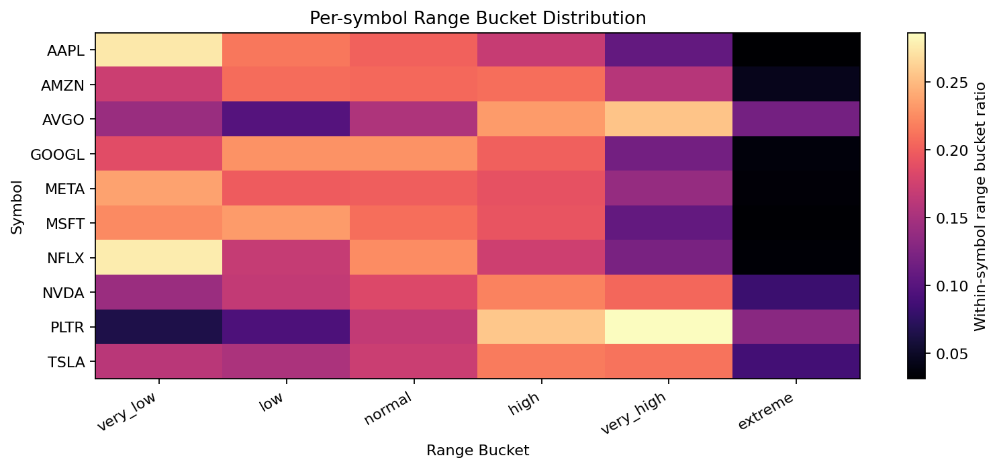

Per-symbol 해석:

| Symbol | Interpretation |
|--------|----------------|
| `AVGO` | high / very_high 비중이 높고 extreme도 train보다 큼 |
| `NFLX` | very_low / normal 비중이 높고 extreme은 낮음 |
| `PLTR` | high / very_high / extreme 비중이 높지만 RKLB만큼 극단적이지 않음 |

구체적인 range bucket counts:

```text
AVGO:
very_low   1,695
low        1,182
normal     1,850
high       2,793
very_high  3,063
extreme    1,417

NFLX:
very_low   3,321
low        2,025
normal     2,700
high       2,082
very_high  1,461
extreme      411

PLTR:
very_low     771
low        1,128
normal     2,001
high       3,080
very_high  3,437
extreme    1,583
```

---

## 19. Shape × Range Pair — Alternative Split

| Run | pair val-train L1 | pair test-train L1 |
|-----|-------------------|--------------------|
| revised `k12` — AMD / INTC / RKLB | 0.8930 | 1.0636 |
| revised `k12_a` — AVGO / NFLX / PLTR | 0.5202 | 0.2721 |

Pair distribution도 `k12_a`에서 훨씬 안정적입니다.

| Split | Used Pairs | Dead Pairs | Pair Entropy |
|-------|------------|------------|--------------|
| train | 67 / 72 | 5 | 5.8853 |
| val | 67 / 72 | 5 | 5.7762 |
| test | 67 / 72 | 5 | 5.9012 |

### 19.1 Shape × Range Pair Heatmap

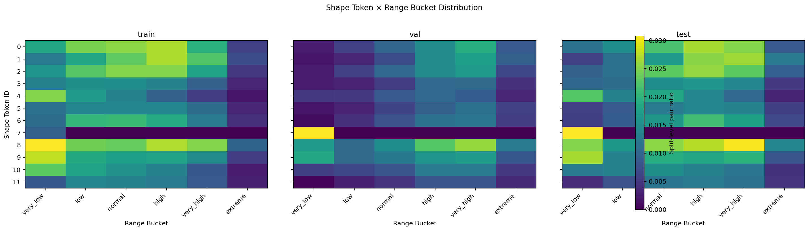

`k12_a`에서는 train / val / test의 pair heatmap 차이가 이전 `AMD / INTC / RKLB` run보다 작습니다. 이는 held-out symbols의 range profile이 train symbols와 더 가깝기 때문입니다.

---

## 20. KMeans Baseline — Alternative Split

| Model | shape val-train L1 | shape test-train L1 | pair val-train L1 | pair test-train L1 |
|-------|--------------------|---------------------|-------------------|--------------------|
| VQ-VAE | 0.2159 | 0.0976 | 0.5202 | 0.2721 |
| KMeans | 0.1730 | 0.0785 | 0.4947 | 0.2684 |

KMeans가 VQ-VAE보다 약간 더 안정적입니다. 이 점은 이전 결과와 동일합니다.

따라서 baseline 관련 결론은 유지됩니다.

> **4D handcrafted price-shape feature에서는 KMeans가 강한 baseline입니다. VQ-VAE가 KMeans보다 우월하다고 아직 주장할 수 없습니다.**

---

## 21. Cross-split Interpretation

두 revised run을 함께 보면 더 중요한 결론이 나옵니다.

| Component | AMD / INTC / RKLB | AVGO / NFLX / PLTR | Interpretation |
|-----------|-------------------|--------------------|----------------|
| Shape token drift | 낮음 | 낮음~중간 | shape vocabulary는 비교적 안정적 |
| Range bucket drift | 매우 큼 | 작음~중간 | range는 종목별 volatility profile에 민감 |
| Pair drift | 매우 큼 | 작음~중간 | pair drift의 대부분은 range bucket 차이에서 발생 |

즉, 종목 조합에 따라 전체 pair distribution은 달라집니다. 하지만 revised design의 장점은 그 차이를 다음처럼 분해해서 볼 수 있다는 점입니다.

```text
shape token 차이인가?
range bucket 차이인가?
둘의 조합 차이인가?
```

현재까지의 결과는 다음 해석을 지지합니다.

```text
shape token은 비교적 안정적입니다.
range bucket은 종목별 volatility profile을 반영합니다.
pair distribution은 range bucket 변화에 따라 달라집니다.
```

따라서 종목별 결과가 달라지는 것은 실패라기보다, range context가 종목별 volatility 차이를 드러내는 현상입니다.

다만 한두 개 split으로 일반화 결론을 내리면 안 됩니다. 이후에는 여러 held-out symbol split을 반복 실행해 다음을 평균과 분산으로 평가해야 합니다.

```text
shape token stability mean ± std
range bucket drift mean ± std
shape-range pair drift mean ± std
```

반복 실험 프로토콜은 별도 문서로 정의합니다.

```text
03_symbol_split_protocol.md
```
