# Phase 1A Result — Price-Shape Only Quantization

이 문서는 `../runs/phase_1a/` 아래의 실제 run artifact와 `metrics.json`을 기준으로 Phase 1A 결과를 정리합니다.

Phase 1A의 질문은 다음입니다.

> **여러 NASDAQ symbols에서 반복적으로 나타나는 candle price-shape를 같은 discrete token으로 묶을 수 있는가?**

이 단계의 token은 **price-shape token**입니다. 아직 **market state token**, trading signal, future return predictor로 해석하지 않습니다.

---

## 1. Source Runs

```text
../runs/phase_1a/price_shape_NASDAQ_1m_k8
../runs/phase_1a/price_shape_NASDAQ_1m_k12
../runs/phase_1a/price_shape_NASDAQ_1m_k16
```

각 run은 다음 artifact를 포함합니다.

```text
experiment_config.json
metrics.json
tokenizer.pt
figures/
  01_global_token_ratio_histogram.png
  02_per_symbol_token_heatmap.png
  03_per_symbol_token_ratio_chart.png
  04_split_token_ratio_difference.png
  05_mean_feature_heatmap.png
  06_prototype_candles.png
  07_feature_scatter.png
  08_vqvae_vs_kmeans_histogram.png
```

---

## 2. Experiment Setup

| Item | Value |
|---|---|
| Market | `NASDAQ` |
| Interval | `1m` |
| Max candles per symbol | `12,000` |
| Min candles per symbol | `500` |
| Epochs | `25` |
| Batch size | `256` |
| Learning rate | `0.001` |
| Seed | `42` |

Symbol universe:

```text
AAPL, MSFT, NVDA, TSLA, AMZN, META, GOOGL, AMD
INTC, RKLB, AVGO, NFLX, PLTR, MU, QCOM, MRVL
```

Held-out symbol split:

```text
train symbols:
  AAPL, MSFT, NVDA, TSLA, AMZN, META, GOOGL, AMD, INTC, RKLB, AVGO
  = 132,000 candles

val symbols:
  NFLX, PLTR
  = 24,000 candles

test symbols:
  MU, QCOM, MRVL
  = 36,000 candles
```

Feature set:

```text
signed_body_ratio
upper_ratio
lower_ratio
body_center_location
```

의도적으로 제외한 정보: `volume_state`, `range_return`, raw OHLC price scale, future return, trading label.

---

## 3. VQ-VAE Summary

| Metric | K=8 | K=12 | K=16 |
|---|---:|---:|---:|
| Train used tokens | 8 / 8 | 12 / 12 | 13 / 16 |
| Val used tokens | 8 / 8 | 12 / 12 | 13 / 16 |
| Test used tokens | 8 / 8 | 12 / 12 | 13 / 16 |
| Train dead tokens | 0 | 0 | 3 |
| Train dead ratio | 0.000 | 0.000 | 0.188 |
| Train entropy | 2.947 | 3.469 | 3.581 |
| Val entropy | 2.949 | 3.504 | 3.602 |
| Test entropy | 2.920 | 3.478 | 3.583 |
| Val-train L1 | 0.061 | 0.089 | 0.086 |
| Test-train L1 | 0.074 | 0.108 | 0.108 |
| Train mean semantic consistency | 0.259 | 0.196 | 0.190 |
| Val mean semantic consistency | 0.268 | 0.196 | 0.190 |
| Test mean semantic consistency | 0.264 | 0.195 | 0.189 |
| Train reconstruction MSE | 0.0199 | 0.0127 | 0.0118 |

핵심 해석:

- `K=8`은 dead token 없이 가장 안정적이지만 shape vocabulary가 coarse합니다.
- `K=12`는 dead token 없이 모든 token을 사용하고, K=8보다 semantic consistency와 reconstruction이 개선됩니다.
- `K=16`은 semantic consistency와 reconstruction은 더 좋아지지만 3개 dead token이 발생합니다. 실제 사용 vocabulary는 13개입니다.
- split drift는 모든 K에서 낮은 편입니다. 특히 K=12의 test-train L1은 `0.108`입니다.

---

## 4. KMeans Baseline

| Metric | K=8 | K=12 | K=16 |
|---|---:|---:|---:|
| Train used clusters | 8 / 8 | 12 / 12 | 16 / 16 |
| Train dead clusters | 0 | 0 | 0 |
| Train entropy | 2.971 | 3.539 | 3.920 |
| Val-train L1 | 0.057 | 0.077 | 0.110 |
| Test-train L1 | 0.090 | 0.096 | 0.108 |
| Train mean semantic consistency | 0.258 | 0.210 | 0.168 |
| Inertia per sample | 0.0762 | 0.0491 | 0.0350 |

KMeans 해석:

- KMeans는 모든 K에서 cluster를 전부 사용합니다.
- `K=16`에서는 VQ-VAE가 3개 dead token을 만들지만 KMeans는 16개 cluster를 모두 사용합니다.
- 4D handcrafted feature에서는 KMeans가 강한 baseline입니다. VQ-VAE의 우위를 주장하려면 반복 split 결과와 Phase 2 sequence metric이 추가로 필요합니다.

---

## 5. Visual Evidence

### K=8

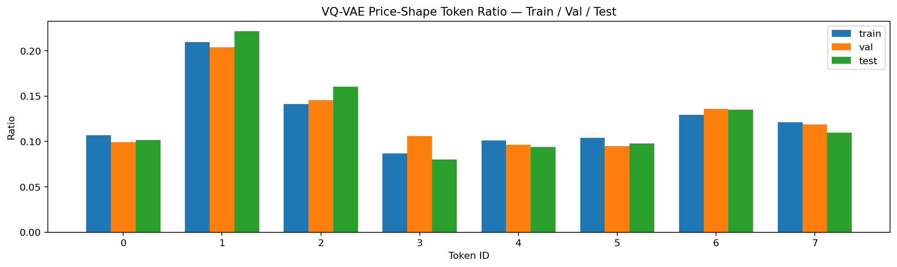

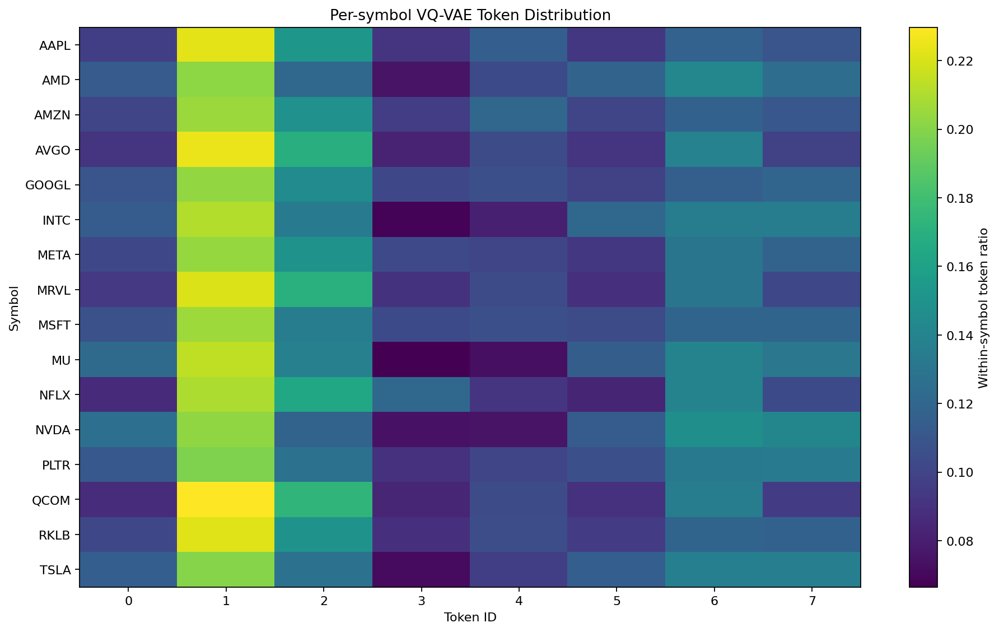

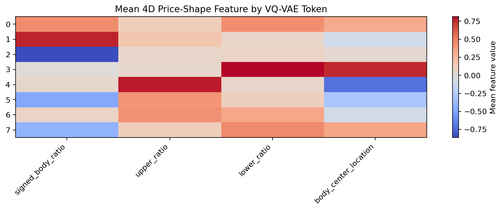

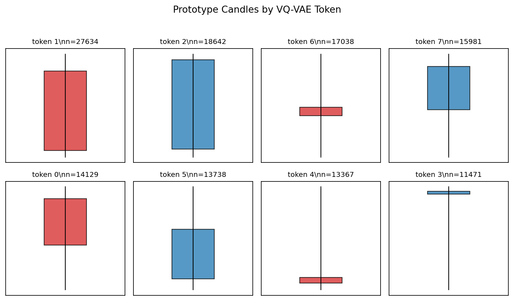

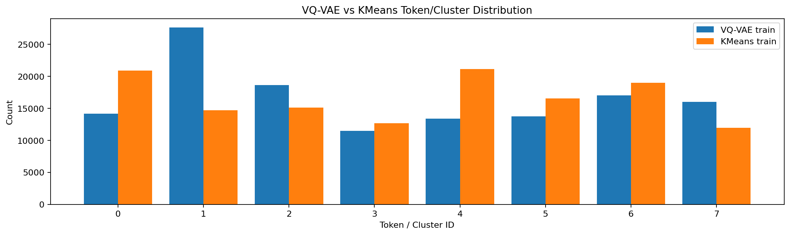

### K=12

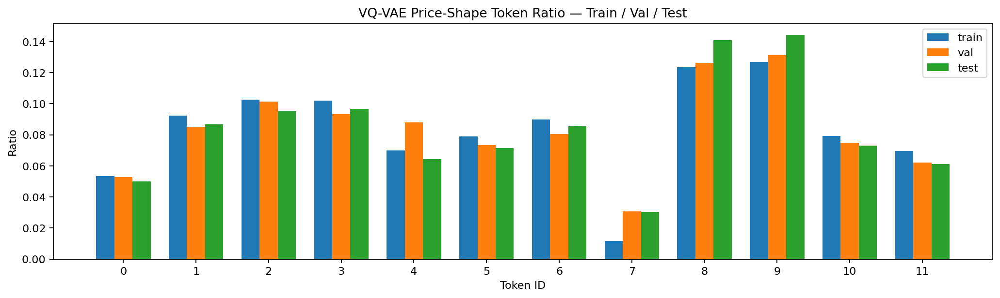

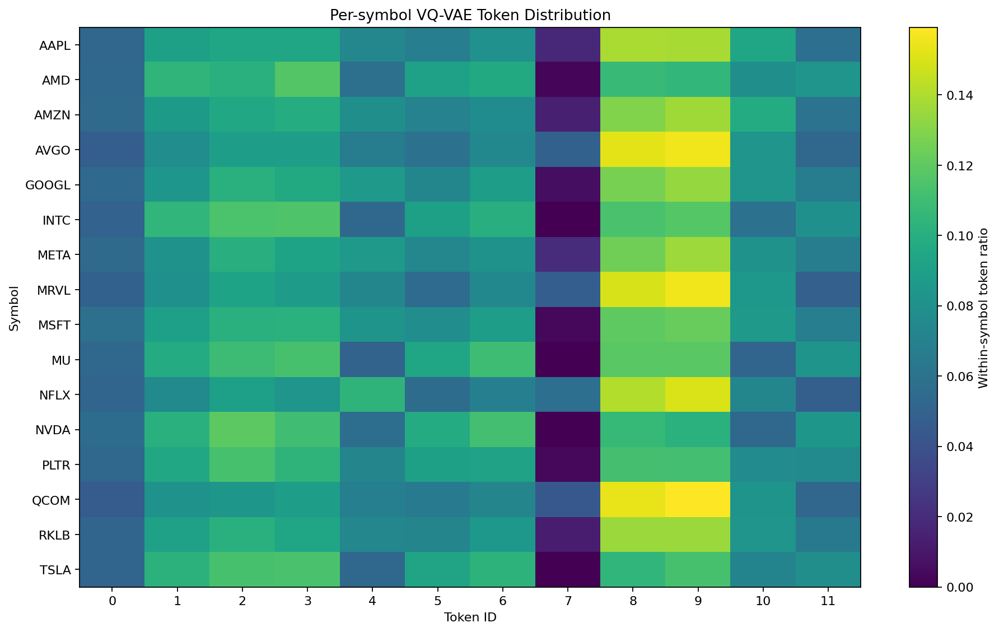

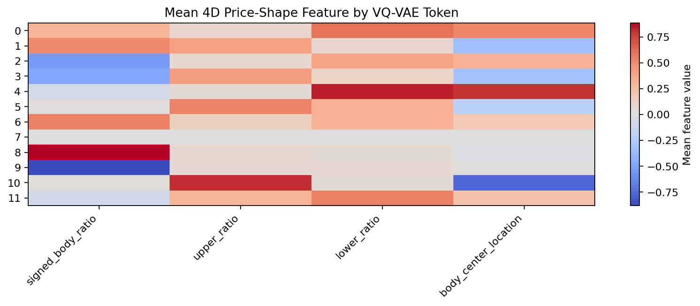

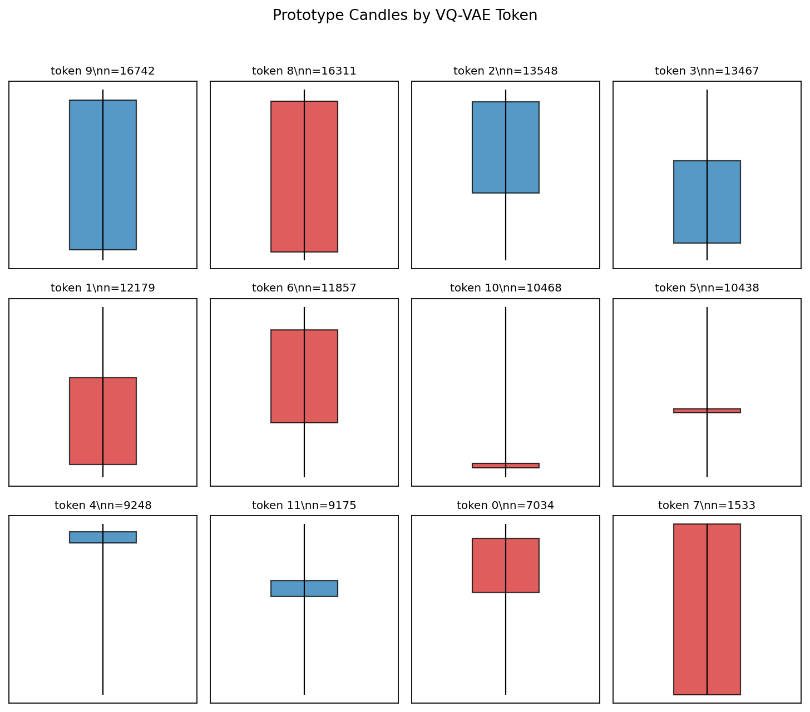

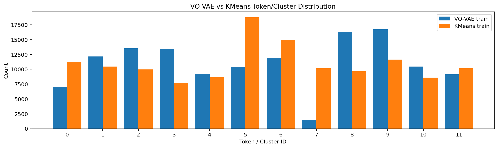

### K=16

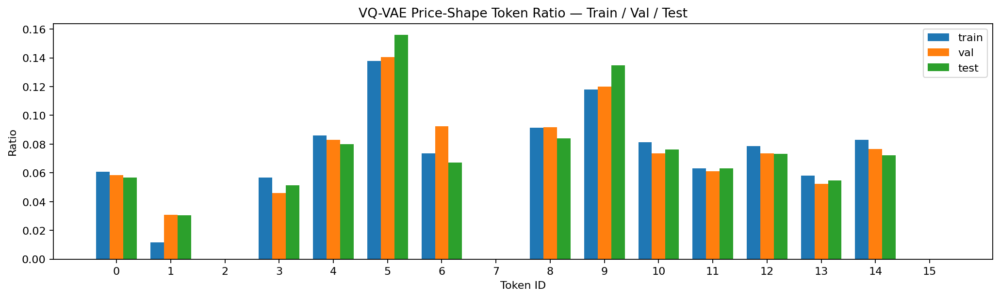

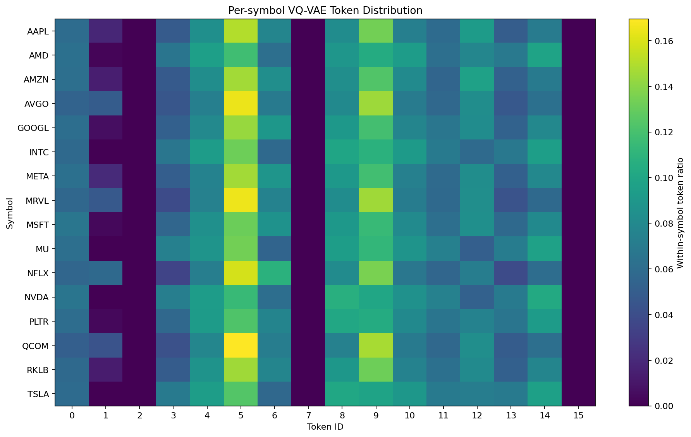

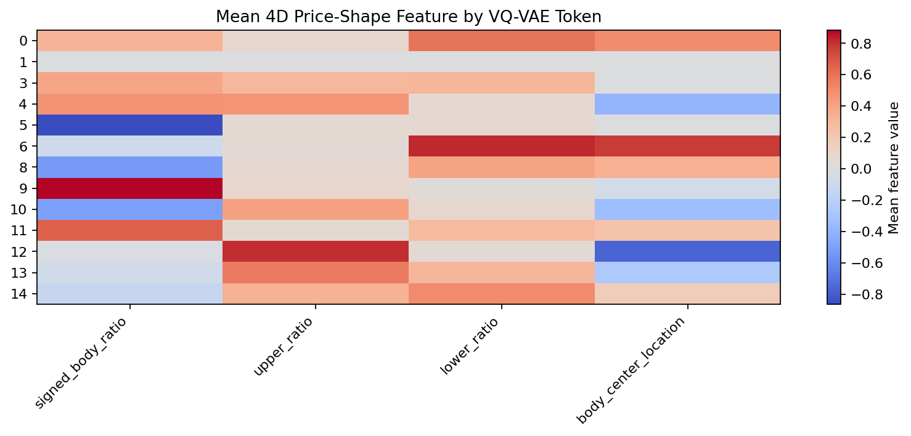

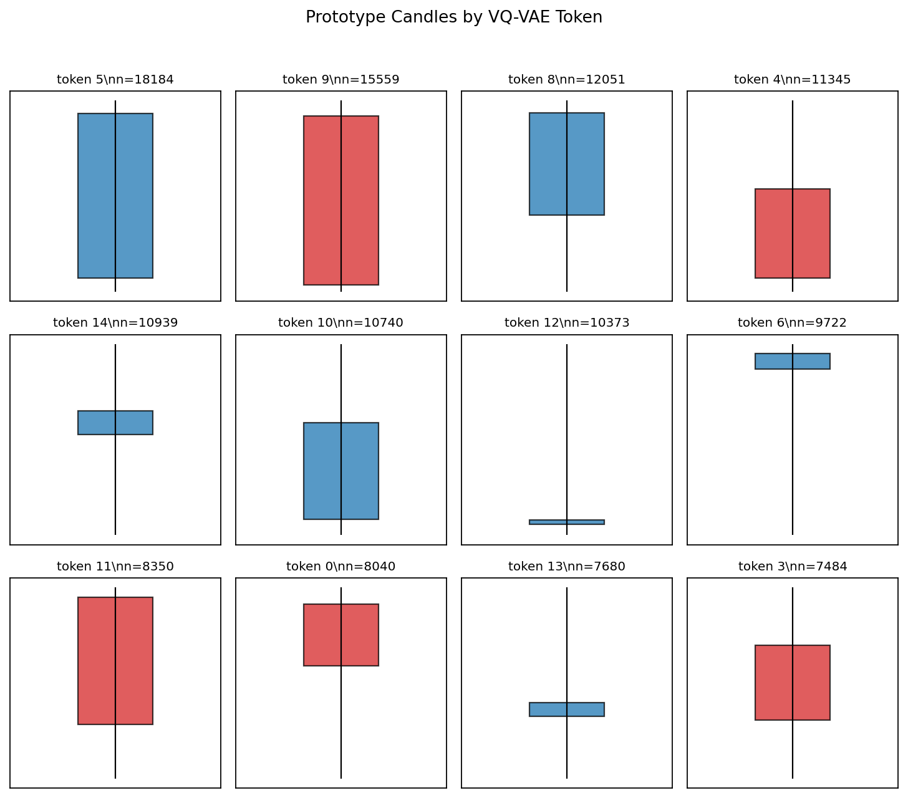

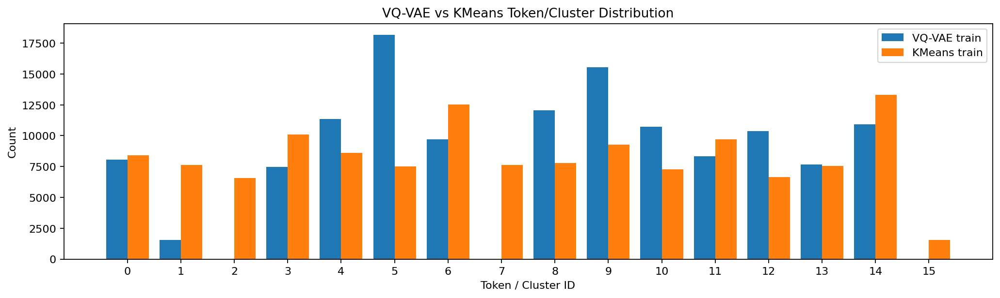

---

## 6. Figure Index

| K | Figure | Path |
|---:|---|---|
| 8 | Global token ratio | `../runs/phase_1a/price_shape_NASDAQ_1m_k8/figures/01_global_token_ratio_histogram.png` |
| 8 | Per-symbol heatmap | `../runs/phase_1a/price_shape_NASDAQ_1m_k8/figures/02_per_symbol_token_heatmap.png` |
| 8 | Per-symbol ratio chart | `../runs/phase_1a/price_shape_NASDAQ_1m_k8/figures/03_per_symbol_token_ratio_chart.png` |
| 8 | Split ratio difference | `../runs/phase_1a/price_shape_NASDAQ_1m_k8/figures/04_split_token_ratio_difference.png` |
| 8 | Mean feature heatmap | `../runs/phase_1a/price_shape_NASDAQ_1m_k8/figures/05_mean_feature_heatmap.png` |
| 8 | Prototype candles | `../runs/phase_1a/price_shape_NASDAQ_1m_k8/figures/06_prototype_candles.png` |
| 8 | Feature scatter | `../runs/phase_1a/price_shape_NASDAQ_1m_k8/figures/07_feature_scatter.png` |
| 8 | VQ-VAE vs KMeans | `../runs/phase_1a/price_shape_NASDAQ_1m_k8/figures/08_vqvae_vs_kmeans_histogram.png` |
| 12 | Global token ratio | `../runs/phase_1a/price_shape_NASDAQ_1m_k12/figures/01_global_token_ratio_histogram.png` |
| 12 | Per-symbol heatmap | `../runs/phase_1a/price_shape_NASDAQ_1m_k12/figures/02_per_symbol_token_heatmap.png` |
| 12 | Per-symbol ratio chart | `../runs/phase_1a/price_shape_NASDAQ_1m_k12/figures/03_per_symbol_token_ratio_chart.png` |
| 12 | Split ratio difference | `../runs/phase_1a/price_shape_NASDAQ_1m_k12/figures/04_split_token_ratio_difference.png` |
| 12 | Mean feature heatmap | `../runs/phase_1a/price_shape_NASDAQ_1m_k12/figures/05_mean_feature_heatmap.png` |
| 12 | Prototype candles | `../runs/phase_1a/price_shape_NASDAQ_1m_k12/figures/06_prototype_candles.png` |
| 12 | Feature scatter | `../runs/phase_1a/price_shape_NASDAQ_1m_k12/figures/07_feature_scatter.png` |
| 12 | VQ-VAE vs KMeans | `../runs/phase_1a/price_shape_NASDAQ_1m_k12/figures/08_vqvae_vs_kmeans_histogram.png` |
| 16 | Global token ratio | `../runs/phase_1a/price_shape_NASDAQ_1m_k16/figures/01_global_token_ratio_histogram.png` |
| 16 | Per-symbol heatmap | `../runs/phase_1a/price_shape_NASDAQ_1m_k16/figures/02_per_symbol_token_heatmap.png` |
| 16 | Per-symbol ratio chart | `../runs/phase_1a/price_shape_NASDAQ_1m_k16/figures/03_per_symbol_token_ratio_chart.png` |
| 16 | Split ratio difference | `../runs/phase_1a/price_shape_NASDAQ_1m_k16/figures/04_split_token_ratio_difference.png` |
| 16 | Mean feature heatmap | `../runs/phase_1a/price_shape_NASDAQ_1m_k16/figures/05_mean_feature_heatmap.png` |
| 16 | Prototype candles | `../runs/phase_1a/price_shape_NASDAQ_1m_k16/figures/06_prototype_candles.png` |
| 16 | Feature scatter | `../runs/phase_1a/price_shape_NASDAQ_1m_k16/figures/07_feature_scatter.png` |
| 16 | VQ-VAE vs KMeans | `../runs/phase_1a/price_shape_NASDAQ_1m_k16/figures/08_vqvae_vs_kmeans_histogram.png` |

---

## 7. Decision

현재 Phase 1A의 기본값은 다음으로 둡니다.

```text
K = 12
feature set = 4D price-shape only
run = ../runs/phase_1a/price_shape_NASDAQ_1m_k12
```

이유:

```text
K=8  : stable but coarse
K=12 : no dead token, improved semantic consistency, interpretable vocabulary
K=16 : lower reconstruction / semantic distance, but dead tokens appear
```

Phase 1A의 결론은 다음 수준으로 제한합니다.

> **여러 NASDAQ symbols에서 반복되는 candle price-shape를 discrete shape token으로 묶는 후보를 만들 수 있습니다.**

아직 다음은 주장하지 않습니다.

```text
market state discovery
future return prediction
trading signal
```

다음 단계에서는 Phase 1B의 `shape_token + range_bucket` 설계를 여러 symbol split에서 반복 검증합니다.
