# Phase 1B Result — Shape Token + Separate Range Bucket

이 문서는 `runs/phase_1b/`에 있는 현재 Phase 1B artifact를 기준으로 정리한 결과입니다.

Phase 1B의 목적은 Phase 1A에서 학습한 **price-shape only shape token**을 유지하면서, candle의 range/volatility context를 별도 bucket으로 분리했을 때 표현이 더 해석 가능하고 반복 실험에서도 안정적인지 확인하는 것입니다.

```text
shape_token  = 4D price-shape feature에서 VQ-VAE가 학습한 discrete token
range_bucket = train split의 log_range_pct quantile로 fit한 volatility bucket
final rep    = (shape_token, range_bucket)
```

핵심 결론은 다음과 같습니다.

> **range scale은 encoder input에 직접 섞지 않고, shape token과 분리된 range bucket으로 관리하는 편이 더 적절합니다.**
>
> fixed split에서는 range drift가 매우 크게 관측되었지만, random split 반복 실험 5회에서는 shape token drift가 대체로 낮게 유지되었습니다.
>
> 따라서 Phase 1B의 기본 표현은 `shape_token + separate range_bucket`으로 유지하되, 아직 최종 통과로 보기는 이릅니다. 다음 단계에서는 `vol_strat`, `vol_holdout` split에서 같은 검증을 반복해야 합니다.

---

## 1. Source Runs

현재 `runs/phase_1b/`에는 다음 run이 있습니다.

```text
runs/phase_1b/
  shape_range_NASDAQ_1m_k12
    # range_scale_z를 encoder input에 직접 넣은 ablation

  shape_token_range_bucket_NASDAQ_1m_k12
    # shape_token + separate range_bucket fixed/manual split run

  shape_token_range_bucket_NASDAQ_1m_k12_random_00
  shape_token_range_bucket_NASDAQ_1m_k12_random_01
  shape_token_range_bucket_NASDAQ_1m_k12_random_02
  shape_token_range_bucket_NASDAQ_1m_k12_random_03
  shape_token_range_bucket_NASDAQ_1m_k12_random_04
    # repeated random symbol split runs
```

집계 CSV는 다음 파일에 있습니다.

```text
summaries/summary.csv
summaries/summary_random.csv
summaries/summary_unknown.csv
```

---

## 2. Shared Setup

공통 설정은 다음과 같습니다.

```text
market: NASDAQ
interval: 1m
codebook size: 12
max candles per symbol: 12,000
range bucket labels:
  very_low, low, normal, high, very_high, extreme
range bucket quantiles:
  20%, 40%, 60%, 80%, 95%
```

Shape feature는 Phase 1A와 동일한 4D price-shape feature입니다.

```text
signed_body_ratio
upper_ratio
lower_ratio
body_center_location
```

Range bucket은 다음 값으로 계산합니다.

```text
range_pct     = (high - low) / reference_price
log_range_pct = log1p(range_pct)
```

중요한 leakage 방지 규칙은 다음과 같습니다.

```text
VQ-VAE는 train candles로만 학습
RangeBucketizer quantile threshold도 train candles로만 fit
val/test는 train-derived statistics로만 transform
```

---

## 3. Ablation — Range Scale as Encoder Input

Run:

```text
runs/phase_1b/shape_range_NASDAQ_1m_k12
```

이 실험은 shape feature 4개에 `range_scale_z`를 추가하여 VQ-VAE input을 5D로 만든 ablation입니다.

```text
signed_body_ratio
upper_ratio
lower_ratio
body_center_location
range_scale_z
```

### 3.1 VQ-VAE Result

| Split | Candles | Used Tokens | Dead Tokens | Entropy | Mean Semantic Consistency | Reconstruction MSE |
|---|---:|---:|---:|---:|---:|---:|
| train | 132,000 | 12 / 12 | 0 | 3.242 | 0.533 | 0.048 |
| val | 24,000 | 12 / 12 | 0 | 3.075 | 0.528 | 0.046 |
| test | 36,000 | 12 / 12 | 0 | 3.499 | 0.555 | 0.069 |

Distribution drift:

| Metric | Value |
|---|---:|
| val-train L1 | 0.135 |
| test-train L1 | 0.627 |

KMeans baseline과 비교하면 다음과 같습니다.

| Model | val-train L1 | test-train L1 | Train Semantic Consistency | Inertia / Sample |
|---|---:|---:|---:|---:|
| VQ-VAE | 0.135 | 0.627 | 0.533 | - |
| KMeans | 0.130 | 0.658 | 0.517 | 0.224 |

### 3.2 Interpretation

이 ablation은 codebook collapse 없이 12개 token을 모두 사용했습니다. 하지만 test split에서 token drift가 크게 증가했습니다.

해석은 다음과 같습니다.

```text
range_scale_z를 encoder input에 직접 넣으면
shape vocabulary가 candle shape뿐 아니라 volatility level에도 민감해진다.
```

즉, token 하나가 다음 두 의미를 동시에 담게 됩니다.

```text
candle shape
range / volatility scale
```

이 방식은 volatility-aware token을 만들 수 있다는 장점은 있지만, Phase 1의 목표인 “비슷한 candle shape을 같은 token으로 묶을 수 있는가?”를 흐립니다. 따라서 기본 설계로 채택하지 않습니다.

### 3.3 Figures

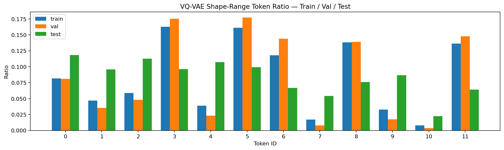

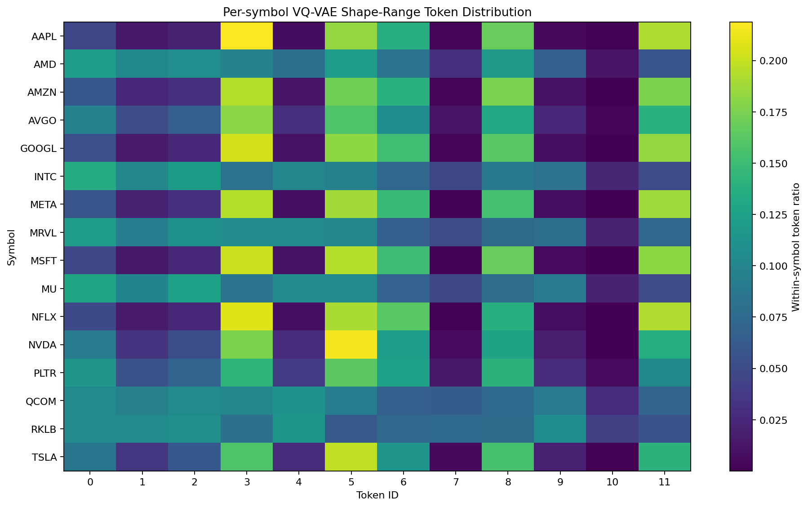

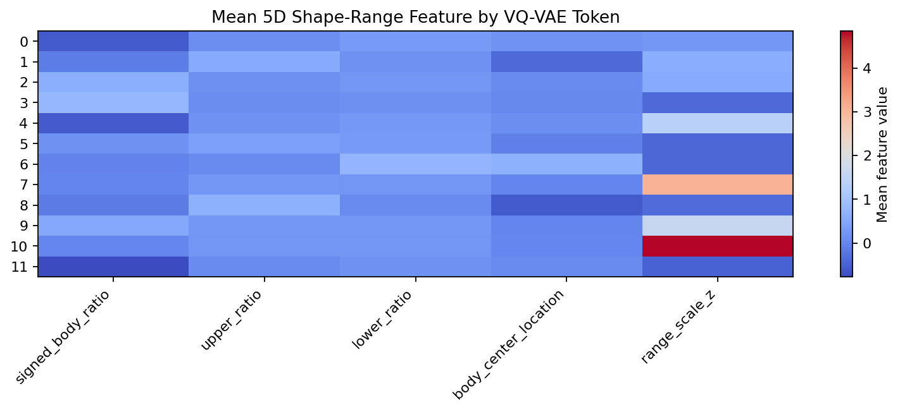

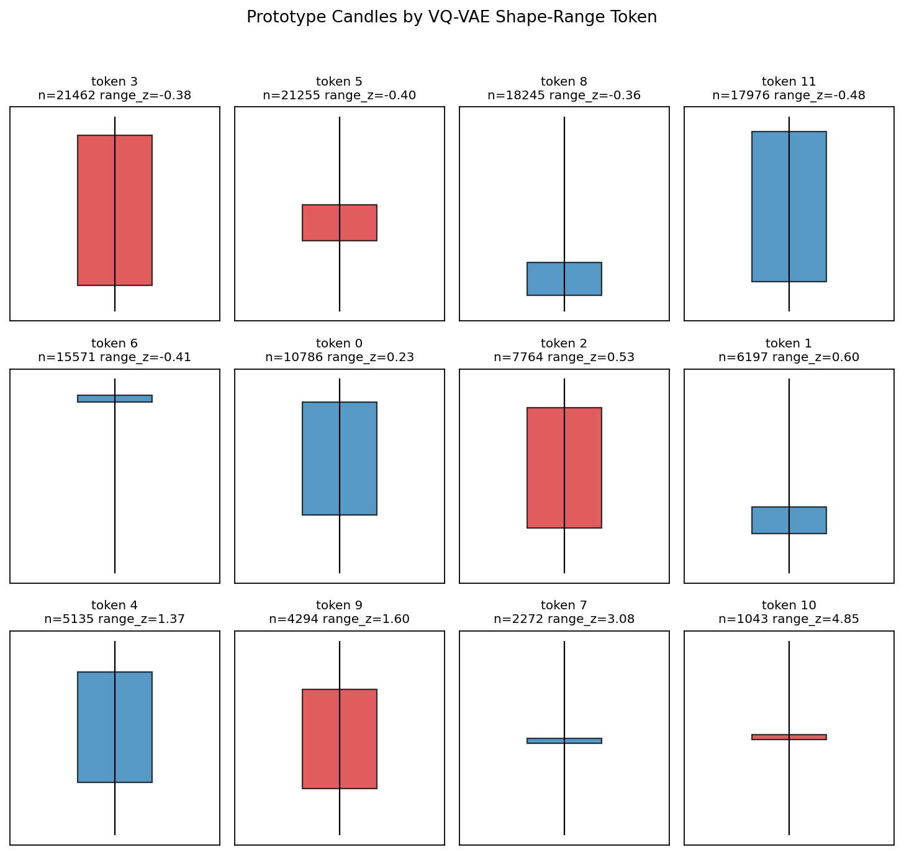

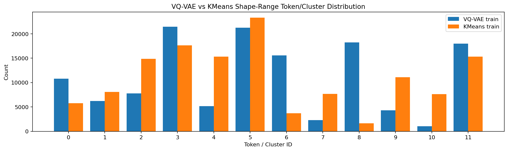

---

## 4. Fixed Split — Shape Token + Separate Range Bucket

Run:

```text
runs/phase_1b/shape_token_range_bucket_NASDAQ_1m_k12
```

Split:

| Split | Symbols | Candles |
|---|---|---:|
| train | AAPL, MSFT, NVDA, TSLA, AMZN, META, GOOGL, AMD, INTC, RKLB, AVGO | 132,000 |
| val | NFLX, PLTR | 24,000 |
| test | MU, QCOM, MRVL | 36,000 |

### 4.1 Shape Token Result

| Split | Used Tokens | Dead Tokens | Entropy | Mean Semantic Consistency | Reconstruction MSE |
|---|---:|---:|---:|---:|---:|
| train | 12 / 12 | 0 | 3.469 | 0.196 | 0.013 |
| val | 12 / 12 | 0 | 3.504 | 0.196 | 0.013 |
| test | 12 / 12 | 0 | 3.478 | 0.195 | 0.012 |

Shape token drift:

| Metric | Value |
|---|---:|
| shape val-train L1 | 0.089 |
| shape test-train L1 | 0.108 |

해석:

- 12개 shape token이 모두 사용되었습니다.
- dead token은 없습니다.
- test split에서도 shape token distribution drift는 낮은 편입니다.
- 이 결과는 Phase 1A K=12 결과와 거의 동일하므로, range bucket을 분리해도 shape vocabulary 자체는 유지됩니다.

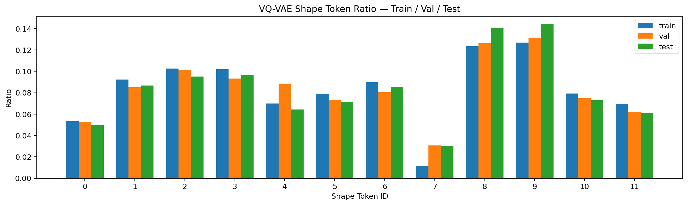

### 4.2 Range Bucket Result

Train split은 quantile 기준으로 fit되므로 의도적으로 다음 분포를 가집니다.

```text
very_low   20%
low        20%
normal     20%
high       20%
very_high  15%
extreme     5%
```

| Split | Used Buckets | Entropy | Range L1 vs Train |
|---|---:|---:|---:|
| train | 6 / 6 | 2.484 | - |
| val | 6 / 6 | 2.387 | 0.137 |
| test | 6 / 6 | 2.348 | 0.674 |

해석:

- val split은 train range profile과 비교적 가깝습니다.
- test split은 `MU`, `QCOM`, `MRVL`의 range profile 때문에 train보다 high/very_high/extreme bucket 비중이 크게 달라졌습니다.
- 이 drift는 실패라기보다 held-out symbol의 volatility profile 차이를 드러내는 신호입니다.

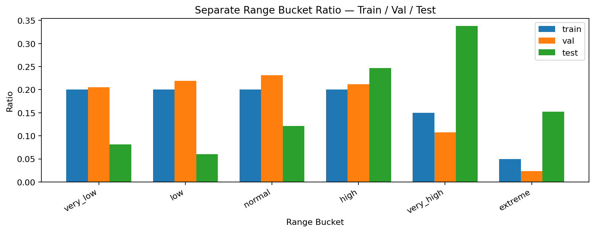

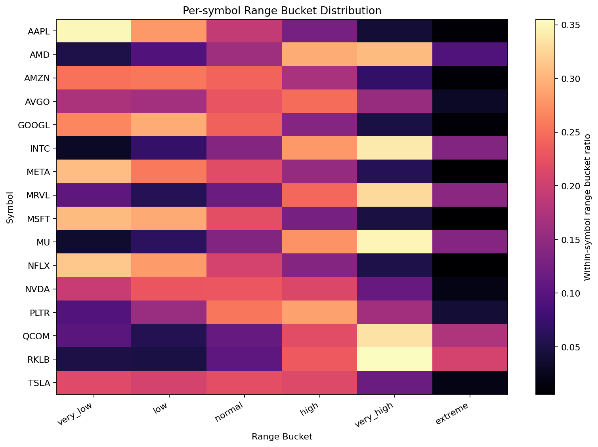

### 4.3 Shape × Range Pair Result

가능한 pair 수는 다음과 같습니다.

```text
12 shape tokens × 6 range buckets = 72 pairs
```

| Split | Used Pairs | Dead Pairs | Entropy | Pair L1 vs Train |
|---|---:|---:|---:|---:|
| train | 67 / 72 | 5 | 5.905 | - |
| val | 67 / 72 | 5 | 5.787 | 0.190 |
| test | 67 / 72 | 5 | 5.683 | 0.712 |

해석:

- shape token 자체는 안정적입니다.
- 하지만 range bucket drift가 pair distribution drift로 크게 반영됩니다.
- 따라서 pair drift는 `shape drift`라기보다 `symbol-level range profile drift`로 보는 편이 더 적절합니다.

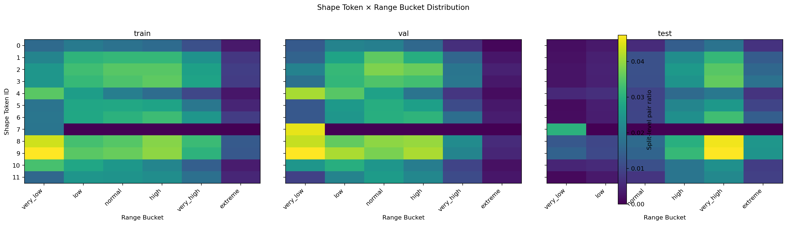

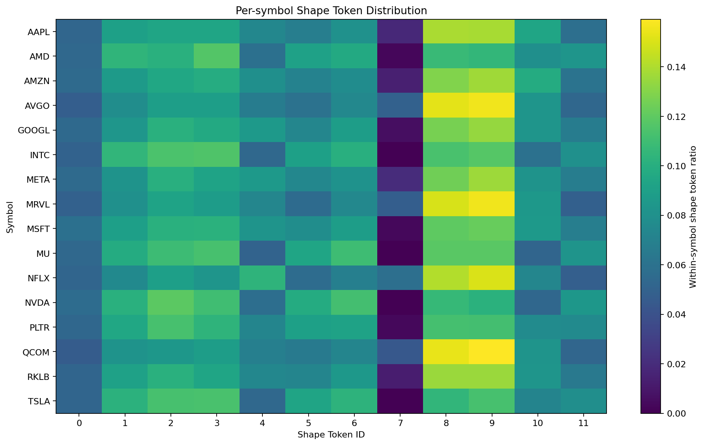

### 4.4 VQ-VAE vs KMeans

| Model | Shape val-train L1 | Shape test-train L1 | Pair val-train L1 | Pair test-train L1 | Train Semantic Consistency | Inertia / Sample |
|---|---:|---:|---:|---:|---:|---:|
| VQ-VAE | 0.089 | 0.108 | 0.190 | 0.712 | 0.196 | - |
| KMeans | 0.077 | 0.096 | 0.197 | 0.701 | 0.210 | 0.049 |

해석:

- fixed split에서는 KMeans가 shape distribution drift 면에서 VQ-VAE와 비슷하거나 약간 더 낮습니다.
- 따라서 현재 결과만으로는 VQ-VAE가 KMeans보다 명확히 우월하다고 말할 수 없습니다.
- 다만 VQ-VAE는 이후 sequential model과 end-to-end 확장 가능성을 고려한 tokenizer 후보로 유지합니다.

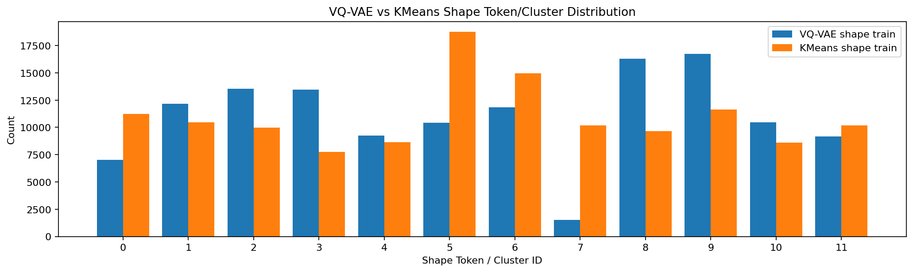

---

## 5. Repeated Random Split Validation

반복 실험은 `scripts/run_repeated_splits.py`로 생성한 random split 5회입니다.

Run list:

```text
runs/phase_1b/shape_token_range_bucket_NASDAQ_1m_k12_random_00
runs/phase_1b/shape_token_range_bucket_NASDAQ_1m_k12_random_01
runs/phase_1b/shape_token_range_bucket_NASDAQ_1m_k12_random_02
runs/phase_1b/shape_token_range_bucket_NASDAQ_1m_k12_random_03
runs/phase_1b/shape_token_range_bucket_NASDAQ_1m_k12_random_04
```

Random split universe는 18개 symbol입니다.

```text
AAPL, AMD, AMZN, AVGO, GOOGL, INTC, META, MRVL, MSFT,
MU, NFLX, NVDA, PLTR, QCOM, QQQ, RKLB, SOXX, TSLA
```

각 run은 다음 candle 수를 사용했습니다.

```text
train: 12 symbols × 12,000 = 144,000 candles
val:    2 symbols × 12,000 =  24,000 candles
test:   4 symbols × 12,000 =  48,000 candles
```

### 5.1 Per-run Metrics

| Run | Seed | Shape val L1 | Shape test L1 | Range val L1 | Range test L1 | Pair val L1 | Pair test L1 | KMeans shape test L1 | KMeans pair test L1 |
|---|---:|---:|---:|---:|---:|---:|---:|---:|---:|
| random_00 | 0 | 0.234 | 0.135 | 0.703 | 0.175 | 0.705 | 0.219 | 0.130 | 0.217 |
| random_01 | 1 | 0.195 | 0.148 | 0.427 | 0.199 | 0.456 | 0.226 | 0.160 | 0.230 |
| random_02 | 2 | 0.140 | 0.054 | 0.380 | 0.163 | 0.451 | 0.193 | 0.051 | 0.193 |
| random_03 | 3 | 0.129 | 0.147 | 0.729 | 0.065 | 0.773 | 0.200 | 0.122 | 0.196 |
| random_04 | 4 | 0.079 | 0.050 | 0.135 | 0.231 | 0.176 | 0.232 | 0.050 | 0.233 |

### 5.2 Aggregate Metrics

| Metric | Mean | Std | Min | Max |
|---|---:|---:|---:|---:|
| shape val-train L1 | 0.155 | 0.060 | 0.079 | 0.234 |
| shape test-train L1 | 0.107 | 0.050 | 0.050 | 0.148 |
| range val-train L1 | 0.475 | 0.247 | 0.135 | 0.729 |
| range test-train L1 | 0.167 | 0.063 | 0.065 | 0.231 |
| pair val-train L1 | 0.512 | 0.238 | 0.176 | 0.773 |
| pair test-train L1 | 0.214 | 0.017 | 0.193 | 0.232 |
| KMeans shape test-train L1 | 0.103 | 0.050 | 0.050 | 0.160 |
| KMeans pair test-train L1 | 0.214 | 0.019 | 0.193 | 0.233 |

추가 안정성 지표:

| Metric | Mean | Std | Min | Max |
|---|---:|---:|---:|---:|
| shape train entropy | 3.440 | 0.111 | 3.243 | 3.498 |
| shape test entropy | 3.425 | 0.135 | 3.185 | 3.496 |
| shape train semantic consistency | 0.199 | 0.006 | 0.196 | 0.210 |
| shape test semantic consistency | 0.199 | 0.007 | 0.195 | 0.211 |
| KMeans inertia / sample | 0.048 | 0.001 | 0.047 | 0.049 |

### 5.3 Random Split Interpretation

Random split 5회에서 가장 중요한 결과는 다음입니다.

```text
mean shape test-train L1 = 0.107
max  shape test-train L1 = 0.148
```

이는 fixed split의 `shape test-train L1 = 0.108`과 거의 같은 수준입니다. 즉, train/test symbol을 random하게 바꾸더라도 shape token distribution은 크게 흔들리지 않았습니다.

반면 range와 pair는 split에 따라 더 크게 흔들립니다.

```text
range val-train L1: 0.135 ~ 0.729
pair  val-train L1: 0.176 ~ 0.773
```

이 차이는 다음을 의미합니다.

```text
shape_token은 candle의 상대적 shape를 비교적 안정적으로 포착한다.
range_bucket은 symbol별 volatility profile 차이를 민감하게 드러낸다.
shape_range_pair는 range_bucket drift의 영향을 함께 받는다.
```

따라서 현재까지의 증거는 `shape_token + range_bucket` 분리 설계를 지지합니다.

### 5.4 Representative Random Split Figures

아래는 `random_00` run의 대표 figure입니다.

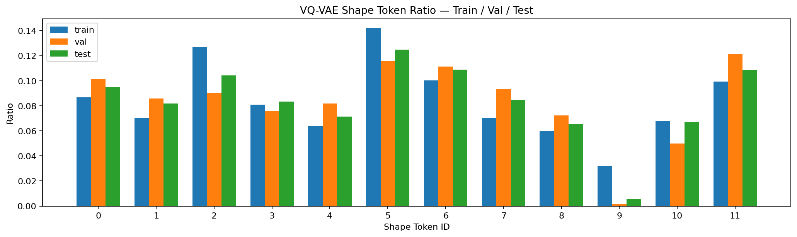

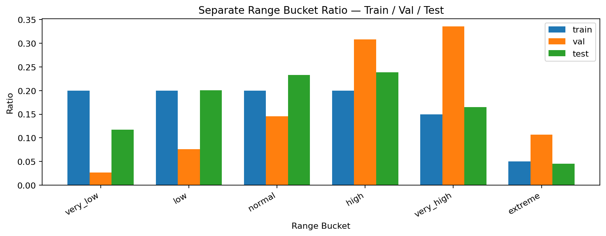

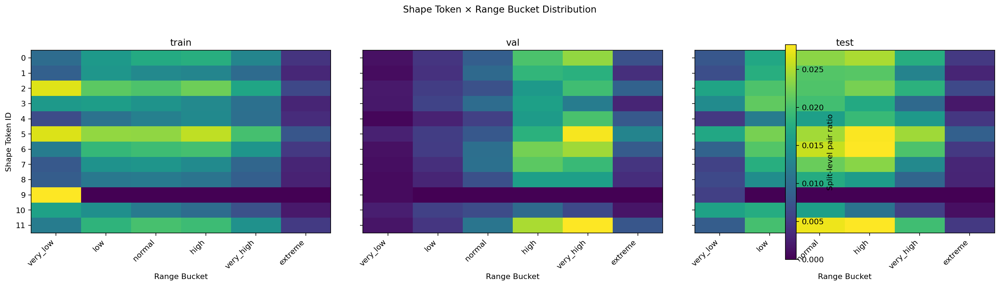

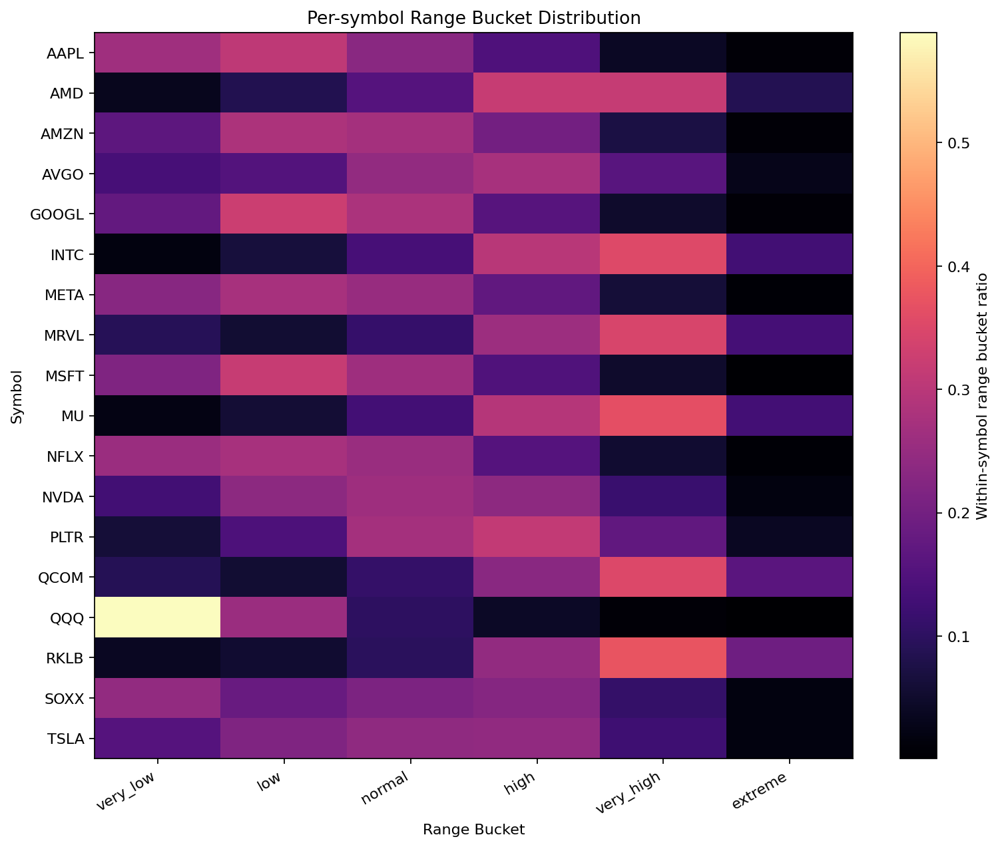

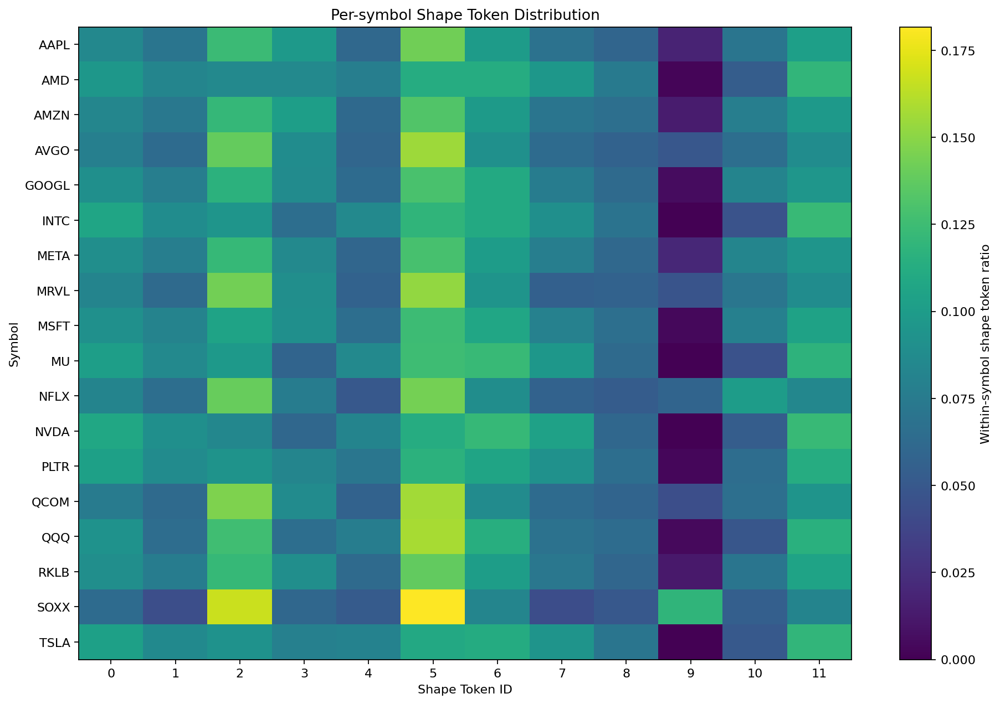

---

## 6. Current Decision

현재 결과를 기준으로 한 판단은 다음과 같습니다.

### 6.1 Adopted Representation

Phase 1B의 기본 표현은 다음으로 유지합니다.

```text
final representation = (shape_token, range_bucket)
```

채택 이유:

1. `range_scale_z`를 encoder input에 직접 넣는 방식보다 의미 분리가 명확합니다.
2. shape token은 fixed split과 random split 반복 실험에서 모두 낮은 test drift를 보였습니다.
3. range bucket은 volatility context를 별도로 드러내므로, symbol별 range profile 차이를 해석하기 쉽습니다.
4. pair distribution drift를 shape drift와 range drift로 분해해서 볼 수 있습니다.

### 6.2 Not Yet Concluded

다만 아직 다음 결론은 내리지 않습니다.

```text
shape token이 시장 상태를 설명한다
shape token이 미래 dynamics를 예측한다
VQ-VAE가 KMeans보다 우월하다
Phase 2로 바로 진입할 수 있다
```

현재까지 확인한 것은 더 제한적입니다.

```text
price-shape only VQ-VAE token은 여러 random symbol split에서 비교적 안정적인 shape vocabulary를 만든다.
range_bucket을 별도 context로 분리하면 volatility drift를 shape drift와 구분해 관찰할 수 있다.
```

---

## 7. Remaining Work

Phase 1B를 더 엄격하게 검증하려면 다음 실험이 필요합니다.

1. `vol_strat` 반복 실험 실행
   - low / medium / high volatility tertile이 train/val/test에 모두 들어가도록 split
   - 목적: volatility composition이 균형 잡힌 상황에서도 shape token이 안정적인지 확인

2. `vol_holdout` 반복 실험 실행
   - high-volatility group을 val/test로 holdout
   - 목적: volatility regime이 바뀌어도 shape token과 range bucket의 역할 분리가 유지되는지 확인

3. repeated split 전체 요약
   - `random`, `vol_strat`, `vol_holdout`, `stress` family별 summary 비교
   - Phase 2 진입 기준 충족 여부 판단

4. KMeans baseline 재검토
   - 현재 수치상 KMeans가 VQ-VAE와 비슷하거나 약간 더 좋은 항목이 있습니다.
   - VQ-VAE를 계속 사용할 근거는 단순 clustering 성능이 아니라 sequential modeling 확장성에서 찾아야 합니다.

---

## 8. Bottom Line

현재 `runs/phase_1b` 결과의 핵심은 다음입니다.

```text
range를 encoder input으로 섞는 방식은 shape vocabulary의 의미를 흐린다.
shape token과 range bucket을 분리하면 해석 가능성이 좋아진다.
random split 5회에서 shape test drift는 평균 0.107, 최대 0.148로 안정적이다.
range/pair drift는 symbol-level volatility profile 차이를 반영한다.
```

따라서 Phase 1B의 현 단계 결론은 다음과 같습니다.

> **`shape_token + separate range_bucket` 설계는 유지한다.**
>
> **하지만 Phase 2로 넘어가기 전에 `vol_strat`과 `vol_holdout` 반복 실험으로 symbol/volatility split robustness를 추가 확인한다.**
